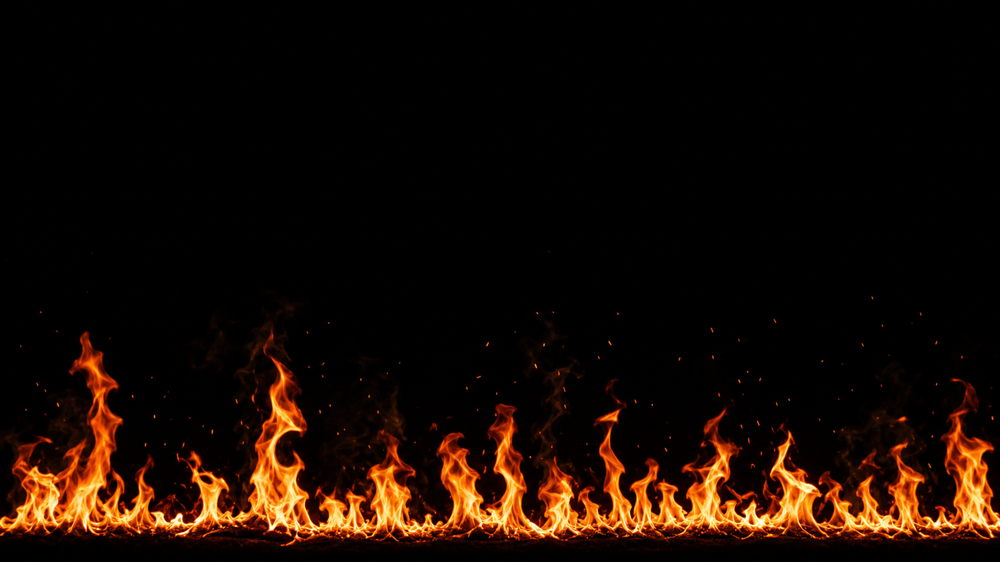
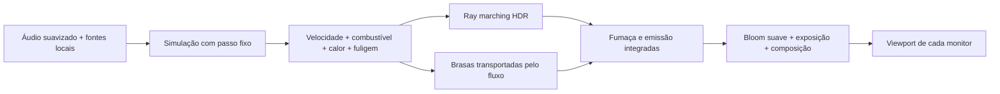

# Estudo de fogo realista para o HYPNIX

Data: 17 de setembro de 2026. Escopo: análise e projeto técnico; nenhum novo wallpaper implementado nesta etapa.

Evolução posterior: o estudo foi implementado como **Living Fire**. O estado atual,
controles e resultados de validação estão em [Living Fire](LIVING_FIRE.md) e
[Visual settings](VISUAL_SETTINGS_DESIGN_PLAN.md). Este documento preserva a pesquisa inicial.

## Decisão recomendada

Para fogo com alto realismo **e reação contínua ao áudio**, proponho um volume 3D de profundidade limitada,
simulado em DirectCompute, com temperatura, combustível e fuligem separados. Faíscas devem acompanhar
o fluxo; brilho e fumaça precisam preservar a estrutura das chamas. A base continua sendo Direct3D 11.

Os exemplos fornecidos são boas referências para movimento, cor e composição, mas os dois de fogo são
efeitos procedurais 2D da mesma família. Copiar sua aparência não nos daria uma simulação de combustão.
Também não precisamos de química industrial completa: a primeira implementação deve ser um modelo
reduzido, explicitamente aproximado, com transporte e resfriamento coerentes.

Para **aparência fotográfica com câmera fixa**, uma filmagem ou simulação previamente renderizada pode
superar um solver pequeno em tempo real. Essa alternativa continua válida como referência ou fallback;
seu limite é que o áudio controla a reprodução/composição, não a combustão interna.

Assumo a composição já aprovada no projeto: fogo na parte inferior de cada monitor, línguas irregulares,
base estreita, poucas brasas e bastante preto acima. A imagem é um alvo de aparência, não uma medição física.



## O que foi realmente inspecionado

Os três links foram abertos no navegador, os efeitos foram observados em execução e o código foi lido
nos editores públicos. No terceiro, foram lidas as abas **Common** e **Image**. O acesso pelo extrator web
falhou, mas o navegador conseguiu carregar os originais. Não usei os ports encontrados na busca como fonte
do comportamento. A leitura abaixo corresponde ao conteúdo disponível nesta data.

| Exemplo | Identificação no original | Estrutura observada | Papel no estudo |
| --- | --- | --- | --- |
| [4ttGWM](https://www.shadertoy.com/view/4ttGWM) | 301's Fire Shader - Remix 3, mu6k | Image, ruído 2D e uma imagem em iChannel0 | Cor mais contida, detalhe e fundo |
| [MtcGD7](https://www.shadertoy.com/view/MtcGD7) | 301's Fire Shader - Remix 2, CaliCoastReplay | Image, ruído 2D, tratamento de cor HSV | Movimento e variação de escala |
| [wl2Gzc](https://www.shadertoy.com/view/wl2Gzc) | Sparks from fire, Jan Mróz / jaszunio15 | Common + Image, pontos por célula e camadas | Brasas, profundidade aparente e fumaça |

O indicador do navegador mostrou 60 FPS a 768 × 432. Isso apenas confirma a execução das referências
nessa sessão: não é benchmark de 4K, medição de custo por shader ou garantia para múltiplos monitores.

## 1. Remix 3: como o fogo é construído

O caminho relevante é `rand → noise → fbm → q → r → color`.
`noise` interpola quatro hashes; `fbm` combina cinco escalas. O domínio cresce por 2,7 a cada oitava
e a amplitude cai por 0,47. Cinco campos temporais formam `q`, que deforma novas amostras de ruído.
Há ainda duas perturbações senoidais nas coordenadas. O resultado parece turbulência ascendente.

A cor final usa uma função inversa de quarta potência dependente de `r.y` e da altura, seguida de
compressão por canal. Uma fotografia em `iChannel0` contribui discretamente ao fundo. Não há temperatura,
densidade persistente, advecção de estado nem integração ao longo de um raio.

**Detalhe do código:** o cálculo anterior de `c` e a primeira atribuição de `color` são sobrescritos.
Esse caminho, inclusive `r.x`, não influencia a saída final. Um compilador pode eliminá-lo; não deve
ser tomado como requisito da técnica. A base muito luminosa e contínua ainda difere do nosso alvo.

Aprendizado: deformação em várias escalas e compressão de exposição ajudam bastante. Para o HYPNIX,
esses recursos devem detalhar uma chama coerente, sem substituir o transporte de calor.
Fonte: [editor original, aba Image](https://www.shadertoy.com/view/4ttGWM).

## 2. Remix 2: parentesco e diferenças

O segundo exemplo compartilha hash, interpolação e FBM com o primeiro. Sua composição combina cinco
campos em `q`, dois em `r` e outro na mistura de cores. São oito avaliações de FBM no código, antes
das otimizações do compilador. Cada uma reúne cinco avaliações de ruído.

Aqui a mistura de paletas alimenta a saída: depois da modulação vertical, o shader transforma RGB em
HSV e altera saturação e valor de forma não linear. A distância aparente também oscila com o tempo.
Na inspeção visual, áreas amarelas/brancas ocuparam uma fração grande da imagem e perderam detalhe.

Não existem campos de combustível, pressão ou fumaça. A chama não conserva uma história de ignição;
ela é recalculada a partir de posição e tempo. É uma solução compacta para visualização estilizada,
mas difícil de controlar como fogo localizado com nascimento, desprendimento e extinção.

Aprendizado: separar movimento grande de detalhe pequeno, mas evitar saturação excessiva, oscilações
globais de zoom e cor HSV como substituto de emissão térmica.
Fonte: [editor original, aba Image](https://www.shadertoy.com/view/MtcGD7).

## 3. Sparks from fire: profundidade sem partículas simuladas

O shader distribui pontos determinísticos por células, deforma suas posições com ruído e desenha
núcleos alongados mais halos. Combina quinze camadas com escalas, velocidades e opacidades diferentes.
Máscaras verticais variáveis fazem as brasas aparecerem e desaparecerem. A fumaça vem de ruído em
camadas; não é um volume que recebe luz das partículas.

O autor descreve a construção como baseada em Voronoi. No código lido, `fireParticles` consulta o ponto
da célula atual; não executa a busca de células vizinhas de um Voronoi completo. Não há buffer de
partículas, integração de velocidade ou colisões. O efeito é convincente como fundo de brasas.

**Problema concreto:** `layeredNoise1_2` declara `offset` sem valor inicial e depois aplica `+=`.
Não se deve presumir zero ao transportar essa lógica para outra plataforma. Nas bordas de célula,
também seria necessário verificar se halos maiores ficam truncados; isso é um risco a testar, não
uma falha visual confirmada nesta inspeção.

Aprendizado: núcleos pequenos, halos discretos e tamanhos variados. Para o nosso fogo, ligar a emissão
das brasas à base e ao fluxo, evitando a aparência de neve laranja.
Fonte: [Common, Image e comentário do autor](https://www.shadertoy.com/view/wl2Gzc).

## 4. O que precisa existir para parecer fogo

O trabalho de Nguyen, Fedkiw e Jensen distingue combustível vaporizado de produtos quentes, trata a
expansão na reação e usa emissão térmica para produtos/fuligem. Também descreve o núcleo azul ligado
à zona de reação química. Portanto, **azul não deve ser simplesmente a ponta quente de uma paleta
de corpo negro**. Para a fogueira alaranjada do alvo, proponho fuligem incandescente como contribuição
principal; uma contribuição azul deve ser localizada e opcional, associada ao tipo de combustível.
Fonte: [Physically Based Modeling and Animation of Fire](https://graphics.stanford.edu/papers/fire-sg02/).

A lei de Planck fornece a distribuição espectral de um emissor térmico em função da temperatura.
Podemos pré-calcular uma LUT de emissão RGB linear e intensidade relativa, em vez de avaliar o espectro
em cada amostra do raio. Esse modelo é uma aproximação para fuligem, não uma descrição de toda a luz
produzida por qualquer chama. Fonte: [PBRT — Light Emission](https://www.pbr-book.org/4ed/Radiometry,_Spectra,_and_Color/Light_Emission).

Critérios visuais propostos para o nosso alvo:

- **Origem:** leito estreito e desigual, com zonas interligadas de emissão; sem régua branca contínua.
- **Corpo:** folhas de chama que se esticam, dobram, afinam e se desprendem, com intervalos escuros.
- **Continuidade:** o detalhe sobe junto com o fluxo; não troca de posição aleatoriamente a cada frame.
- **Extinção:** fragmentos perdem calor e luminosidade; fumaça pode sobreviver à chama.
- **Luz:** detalhe laranja/amarelo dentro das regiões claras, com poucos pontos realmente brancos.
- **Brasas:** esparsas, tamanhos e tempos de vida variados; trajetória com inércia e influência da pluma.

## 5. Comparação das rotas

Esta tabela é uma avaliação de engenharia para o HYPNIX, não um resultado de benchmark.

| Rota | Força | Limitação | Decisão |
| --- | --- | --- | --- |
| Shader 2D como os dois exemplos | Pouco estado e integração simples | Controle físico e profundidade limitados | Referência de aparência; opção estilizada |
| Filme/flipbooks autorais | Maior chance de aparência fotográfica imediata | Repetição, ângulo fixo, resposta interna ao áudio limitada | Referência e fallback possíveis |
| Campo 2D com profundidade sugerida | Transporte persistente com custo menor | Interação entre camadas e visão lateral limitadas | Alternativa econômica a avaliar |
| Solver 3D reduzido + render volumétrico | Estado coerente, áudio atua na fonte, profundidade real | Maior custo e complexidade; realismo não garantido | Rota principal de pesquisa |
| Simulação offline de alta qualidade | Maior teto de detalhe | Não calcula a reação ao áudio em tempo real | Gerar referências próprias |

O caso Vulcan documenta uma solução convincente com sprites animados e fumaça, além de problemas de
saturação com soma aditiva e economia obtida por composição em resolução menor. Isso contraria a ideia
de que somente simulação ao vivo pode parecer real. Sua adequação depende do objetivo: câmera fixa e
aparência fotográfica, ou interação interna com o áudio. Fonte: [GPU Gems, capítulo 6](https://developer.nvidia.com/gpugems/gpugems/part-i-natural-effects/chapter-6-fire-vulcan-demo).

## 6. Por que o protótipo atual não deve ser apenas retocado

A leitura de [HypnixVolumetricFire.hlsl](../Shaders/HypnixVolumetricFire.hlsl) confirma o histórico em
[VOLUMETRIC_FIRE_RESEARCH.md](VOLUMETRIC_FIRE_RESEARCH.md):

1. O volume armazena velocidade XYZ e uma única densidade. `fireColor` recebe essa densidade como se fosse calor.
2. Não existe projeção de pressão; `velocity.y` é atualizada, mas o backtrace vertical usa outra velocidade
   calculada a partir da densidade/áudio, não o vetor completo de velocidade.
3. A injeção ocupa uma faixa inteira junto à base. A modulação não define fontes volumétricas bem separadas.
4. Atenuação e movimento são aplicados por chamada. `FluidResources.Advance` executa uma atualização por
   apresentação e não recebe um passo físico de tempo. Mudar o FPS muda a evolução da simulação.
5. O render percorre fatias em profundidade e colore por densidade. A absorção usa um fator constante por
   fatia, sem comprimento físico explícito; mudar a amostragem pode mudar a aparência.
6. O jitter temporal não vem acompanhado de reconstrução temporal controlada.

A infraestrutura de texturas 3D, limpeza, dispatch e isolamento por viewport pode servir de referência.
A dinâmica e a representação óptica precisam de uma implementação separada. O protótipo rejeitado
permanece fora da galeria.

## 7. Arquitetura proposta

O capítulo de fluidos do GPU Gems 3 fornece uma base útil: transporte de campos em texturas 3D,
projeção de velocidade, controle de vorticidade, coordenada de reação e ray marching. Ele também mostra
que uma aproximação visual pode reduzir a complexidade da combustão. Usaremos esses conceitos como
fundamento; a organização e os parâmetros abaixo são uma proposta específica ainda não validada.
Fonte: [GPU Gems 3, capítulo 30](https://developer.nvidia.com/gpugems/gpugems3/part-v-physics-simulation/chapter-30-real-time-simulation-and-rendering-3d-fluids).



### Campos e simulação

Proponho dois volumes RGBA16F para velocidade, dois para escalares
`combustível / temperatura / fuligem / progresso da reação`, pressão em dois R32F,
divergência em R32F e um temporário RGBA16F para vorticidade.

Oxidante inicialmente pode ser aproximado por disponibilidade de ar/mistura nas interfaces. Isso deve
ser identificado como hipótese artística, não como conservação química demonstrada. Se houver queima
homogênea em todo o combustível, acrescentar um campo de oxidante é uma possível evolução.

Passos planejados:

1. Injetar combustível e calor em fontes de largura, profundidade e atividade diferentes.
2. Transportar velocidade; aplicar empuxo, vento lento e vorticidade limitada.
3. Calcular divergência, resolver pressão e projetar o escoamento. Começar com aproximação de baixa
   velocidade e expansão simplificada; combustão expansiva mais fiel exige tratamento adicional.
4. Transportar os escalares com a velocidade projetada.
5. Consumir combustível disponível, produzir calor/fuligem e atualizar a reação sem valores negativos.
6. Resfriar e dissipar com taxas por segundo, não multiplicadores dependentes do FPS.
7. Atualizar brasas e preparar os campos para renderização.

Começar com semi-Lagrangiano para depuração. Avaliar MacCormack com limitadores depois, caso a difusão
apague as folhas de chama. Ruído fino deve deformar detalhe transportado; não deve recriar a forma
principal independentemente a cada frame.

As dimensões físicas do domínio precisam acompanhar o tamanho das células. Em grids não cúbicos,
usar espaçamento por eixo em derivadas e backtrace. Base com entrada localizada, topo aberto e laterais
com saída controlada; evitar reflexão artificial do fluxo na caixa.

### Tempo e áudio

Proposta inicial: simulação a 60 passos por segundo, independente de apresentação em 15/30/60 FPS.
Um acumulador executa 4/2/1 passos por frame nesses casos. Limitar a recuperação após atraso e descartar
tempo acumulado ao retomar uma pausa, evitando uma sequência de explosões para alcançar o relógio.
Um preset econômico pode simular a 30 Hz, com parâmetros expressos em segundos.

| Entrada | Parâmetro de destino | Ponto de partida para experimentos |
| --- | --- | --- |
| Silêncio | Chamas piloto persistentes | Fonte baixa, nunca reiniciada a cada frame |
| Graves/onsets | Vazão e impulso na fonte | Ataque 40–80 ms; retorno 300–700 ms |
| Médios | Perturbação do fluxo | Variação limitada, sem girar toda a imagem |
| Agudos | Taxa de emissão de brasas | Pulsos raros com teto de partículas |

Esses tempos são parâmetros propostos, não dados medidos nas referências. Evitar multiplicar diretamente
o brilho de todo o frame pelo FFT. Se `AethelisAudioProfile` comprimir demais a dinâmica, introduzir um
perfil específico para fogo. A suavização já aplicada na captura deve ser considerada para não somar atraso.

### Renderização óptica

Delimitar o volume, intersectar o raio com essa caixa e acumular emissão/absorção em HDR linear.
Para uma amostra homogênea de comprimento `ds`, usar a forma integrada da atenuação exponencial:

```text
a = 1 - exp(-sigma_t * ds)
C += transmittance * (j / sigma_t) * a
transmittance *= 1 - a
```

Aqui `j` é a emissão por comprimento e `sigma_t` é a extinção, ambas em unidades compatíveis com o
domínio. Quando `sigma_t` tende a zero, usar o limite `j * ds`, evitando divisão instável. Essa forma
mantém a espessura óptica aproximadamente consistente ao mudar o número de amostras.

Proponho LUT térmica modulada pela fuligem quente, absorção separada para fumaça e iluminação aproximada
da fumaça pela região emissora. Começar com exposição fixa e bloom estreito após o HDR, antes da saída
final; não corrigir volume opaco aumentando o brilho. Tone mapping e conversão de saída devem ocorrer
uma única vez. Fundo preto permite adiar distorção térmica: não há textura para refratar acima do fogo.

Se for usada acumulação temporal, limitar o peso do histórico e rejeitá-lo nas mudanças de fonte,
posição, escala ou viewport. Fogo muda rápido; histórico pesado cria rastros. Congelamento por monitor
deve preservar também jitter, histórico, partículas e contador da simulação.

### Brasas

Para a rota principal, proponho um buffer de partículas com posição, velocidade, idade e temperatura.
Emissão nasce nas fontes; o fluxo arrasta as brasas, enquanto gravidade, arrasto e resfriamento limitam
a trajetória. Desenhar pequenos segmentos ou quads orientados pela velocidade, com comprimento de
rastro relacionado ao tempo de exposição, e não à duração arbitrária do frame.

Usar brilho aditivo moderado para brasas muito pequenas; tratar sua ocultação pela fumaça. Partículas
grandes e desfocadas devem ser poucas. Uma versão econômica pode empregar pontos procedurais em
camadas como na referência, com controle explícito de densidade e bordas, identificando a profundidade
como aproximada. Não sobrepor o efeito completo de quinze camadas por padrão.

## 8. Orçamento de GPU e memória

Estimativas calculadas, **não medições**. Com os buffers propostos acima: 52 bytes por voxel
(16 velocidade + 16 escalares + 8 pressão + 4 divergência + 8 vorticidade).

| Grid inicial de experimento | Voxels | Buffers de simulação por viewport |
| --- | ---: | ---: |
| 160 × 96 × 48 | 737.280 | 36,56 MiB |
| 192 × 128 × 64 | 1.572.864 | 78,00 MiB |
| 256 × 160 × 80 | 3.276.800 | 162,50 MiB |

Esses números excluem HDR, bloom, histórico, staging, partículas, driver e temporários adicionais de
MacCormack. Dois monitores e um preview independente podem triplicar a parte persistente. Compartilhar
temporários só dentro do mesmo dispositivo/contexto e com uso serializado; o desenho atual tem hosts
distintos para desktop e preview.

Em 4K, 64 amostras por pixel equivalem a até **530.841.600 avaliações de volume por frame**, antes de
early exit ou recorte. Renderizar a metade da resolução em cada eixo reduz isso a 132.710.400.
Cada avaliação ainda pode ler múltiplos campos. Portanto:

- Simular só a faixa com fogo e alguma margem acima; não alocar o volume pela resolução inteira da tela.
- Renderizar inicialmente em meia resolução linear e reconstruir bordas com cuidado.
- Recortar raios fora do domínio e terminar quando a transmitância for muito baixa.
- Avaliar ocupação por blocos quando o volume estiver esparso.
- Medir separadamente simulação, ray marching, brasas e bloom com timestamps de GPU.

Meta inicial de engenharia: tentar manter o conjunto em até 4–6 ms por frame para o cenário de desktop
escolhido, com o preview incluído no orçamento. Essa meta pode falhar; reduzir qualidade e medir antes
de prometer 60 FPS. A alocação entre monitores deve ser explícita, não 4–6 ms concedidos a cada um.

## 9. Integração prevista no repositório

Nomes abaixo são sugestões para uma implementação futura:

| Área | Alteração proposta |
| --- | --- |
| `Services/FireSimulation.cs` | Recursos, passes de compute, passo fixo, fontes e partículas |
| `Services/FireGpuRenderer.cs` | Ray marching, HDR, fumaça, bloom e exposição |
| `Shaders/Fire/*.hlsl` | Kernels separados para depurar cada estágio |
| `Services/NativeWallpaperHost.cs` | Selecionar a sessão e respeitar o ciclo de vida do render worker |
| `Services/PerMonitorVisualizerFreezeState.cs` | Usar a política existente; o solver precisa preservar também o próprio estado GPU |
| `Services/VisualizerSettings.cs` | Aplicar tamanho/posição ao domínio; intensidade zero apaga a saída |
| `Services/WallpaperCatalog.cs` | Só declarar suporte a controles implementados e testados |
| `Tests/Hypnix.NativeSmoke` | Comparações visuais, campos de diagnóstico, pausa e medição de GPU |

Evitar acrescentar mais um caso complexo ao renderer genérico de Aethelis. O formato atual de pacote
seleciona implementações internas permitidas; ele não importa shaders de Shadertoy automaticamente.
A galeria e o pacote portátil só devem receber a nova entrada quando houver resultado visual aceito.

## 10. Plano de validação e critérios de avanço

**Etapa A — fontes e escoamento.** Uma única pluma, sem bloom nem faíscas. Salvar campos de temperatura,
combustível, fuligem, velocidade e divergência. Verificar valores finitos, limites, sinal do empuxo,
resfriamento e redução da divergência após projeção. Se a dinâmica ainda for uma coluna lisa, corrigir
o transporte antes de acrescentar detalhes.

**Etapa B — emissão e silhueta.** Várias fontes acopladas, cores térmicas, extinção e fumaça. Comparar
capturas em 0, 2, 8 e 30 segundos e vídeo de pelo menos um minuto com o alvo. Mesmo instante/seed,
qualidades diferentes: mais amostras não devem mudar drasticamente a opacidade ou a exposição.

**Etapa C — áudio e brasas.** Silêncio, impulsos isolados e trechos constantes. Confirmar crescimento na
fonte, continuidade após um beat e resfriamento gradual. Verificar que a cena continua legível com
glow zero: se o fogo só funcionar com blur, a forma ainda não está resolvida.

**Etapa D — integração.** Dois monitores com resoluções/DPI diferentes; congelar somente um e comparar
pixels e estado simulado. Retomar sem salto temporal. Cobrir troca rápida, Stop durante preparação,
timeout, recriação de host e preview minimizado. Exercitar intensidade zero, sensibilidade zero,
escala/posição e persistência por wallpaper.

**Etapa E — carga prolongada.** Rodar por 10 minutos, registrar P50/P95 de GPU por passe, memória,
contagem de partículas e comportamento ao mudar 15/30/60 FPS. Comparar a evolução após o mesmo tempo
simulado, usando tolerância quando a GPU não for determinística. Testar uma GPU integrada e uma dedicada
antes de estabelecer os presets de qualidade.

Não existe teste numérico que, sozinho, certifique realismo. A revisão visual deve rejeitar: linha branca
contínua, topo retangular, ruído que ferve sem subir, chamas idênticas repetidas, fumaça como névoa laranja
uniforme, chuva densa de faíscas, flicker temporal e halos que escondem todo o detalhe.

## 11. Origem e uso dos exemplos

Os exemplos 1 e 2 creditam uma cadeia de remixes. Não encontrei declaração explícita de licença
comercial permissiva em seus códigos lidos. Este estudo não presume autorização de incorporação.

O exemplo de faíscas declara **CC BY 3.0** e o nome de Jan Mróz no código. A licença permite uso e
adaptação comercial com as condições aplicáveis de atribuição e indicação de alterações; isso não
transfere direitos sobre o vídeo externo usado como referência pelo autor.
Fonte: [Creative Commons, Attribution 3.0](https://creativecommons.org/licenses/by/3.0/).

A recomendação para este trabalho é implementar os conceitos com código próprio e registrar as
referências honestamente. Como o código original foi estudado, não descrever o processo como uma
implementação isolada de qualquer contato com fontes externas. Se houver decisão futura de incorporar
código CC BY, a allowlist atual dos testes precisará tratar essa licença e os créditos explicitamente;
ela não a inclui hoje. Nenhum código desses shaders foi adicionado ao runtime neste estudo.

## Próxima entrega concreta

Um protótipo isolado de **uma única chama volumétrica**, com visualizações dos campos e medição de GPU,
seguido de avaliação da forma sem bloom. Só depois: leito de múltiplas fontes, áudio e faíscas. Essa ordem
permite descobrir cedo se o solver sustenta a aparência desejada, antes de investir na integração completa.
