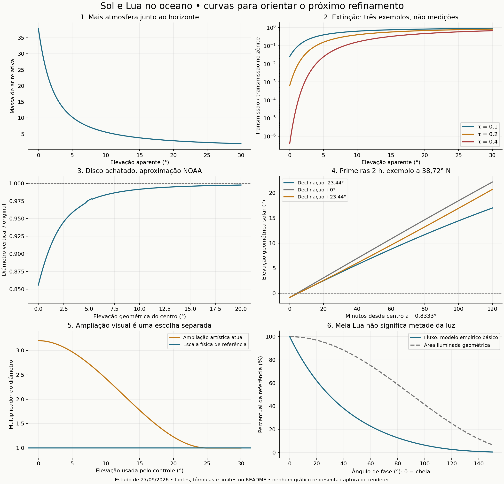

# Oceano — estudo do Sol, Lua e evolução do dia

Data: **27/09/2026**. Base de código examinada: **`9d270a6`**, com água, mapa lunar e ampliação visual no horizonte aprovados. **Este trabalho é pesquisa e documentação; não implementa o ciclo nem altera a prévia.**

Objetivo: tornar convincentes o nascer, a subida, a descida e o pôr dos astros, sobretudo nas primeiras duas horas, preservando o equilíbrio entre qualidade e consumo. O próximo ganho deve vir da relação entre **posição, atmosfera, textura, exposição e reflexo**, mantendo o campo de ondas aprovado.

Implementação posterior autorizada pelo utilizador: [ciclo celeste — implementação e validação](OCEAN_CELESTIAL_CYCLE_IMPLEMENTATION.md). Este documento conserva a distinção entre proposta e evidência da pesquisa original; o registro posterior identifica o que foi implementado e seus limites.

Os resultados abaixo distinguem **dados de fontes primárias**, **cálculos reproduzíveis**, **diagnóstico do código** e **propostas ainda não implementadas**. Nenhuma tabela de cor deste estudo é uma medição meteorológica do local do utilizador.

## 1. Decisões que a pesquisa sustenta

1. **Usar elevação angular e atmosfera para controlar a aparência.** “Trinta minutos depois de nascer” não corresponde à mesma altura em todas as estações e latitudes. A maior resolução das curvas deve ficar entre 0° e 5°.
2. **Separar tamanho físico, refração e ampliação artística.** O disco baixo pode ficar achatado; o aumento visual de até 3,2× já aprovado é uma escolha cinematográfica. Não é uma ampliação física causada pela atmosfera.
3. **Deixar a Lua atravessar a mesma atmosfera que o Sol.** Hoje existem duas compensações que impediriam a evolução natural da cor lunar: radiância compensada por transmissão inversa e RGB fixo do disco.
4. **Separar auréola atmosférica, nuvens e bloom da câmera.** Uma Lua baixa não deve perder crateras por receber um desfoque amplo e obrigatório.
5. **Calcular Sol e Lua simultaneamente.** A Lua pode estar no céu durante o dia. Sua fase e trajetória não são uma cópia da trajetória solar com atraso fixo de 12 horas.
6. **Criar um relógio celeste separado do tempo da água e do vento.** Acelerar o dia não deve acelerar o mar.

**Capacidade técnica:** D3D11 e a estrutura atual de texturas/cache são suficientes para desenvolver esse refinamento sem acrescentar uma dependência de reconstrução por IA. O custo de um céu em movimento, porém, ainda precisa ser medido; o benchmark atual usa direções celestes fixas.

## 2. Tamanho: três grandezas diferentes

### 2.1 Diâmetro astronômico

| Corpo | Diâmetro angular de referência | Significado |
| --- | --- | --- |
| Sol | 1.919″ a 1 UA = **0,5331°** | Varia com a distância Terra–Sol |
| Sol, intervalo da ficha NASA | **0,5242°–0,5422°** | Variação orbital; não uma curva de crescimento ao nascer |
| Lua, média de oposição da ficha NASA | 1.896″ = **0,5267°** | Usar distância topocêntrica para a imagem de um observador |
| Lua, faixa operacional arredondada do USNO | Cerca de **0,50°–0,57°** | Não representa limites absolutos de todas as efemérides |

Fontes: [NASA — Sun Fact Sheet](https://nssdc.gsfc.nasa.gov/planetary/factsheet/sunfact.html), [NASA — Moon Fact Sheet](https://nssdc.gsfc.nasa.gov/planetary/factsheet/moonfact.html), [USNO — definições](https://aa.usno.navy.mil/faq/RST_defs).

Para um corpo esférico: `diâmetro = 2 × asin(raio / distância ao observador)`. Manter raio/distância na mesma unidade. O valor armazenado no shader deve indicar explicitamente se representa **raio** ou **diâmetro**, e se usa radianos ou graus.

**Limite de resolução, cálculo próprio:** com FOV vertical de 42°, um disco solar médio centrado ocupa aproximadamente **13,09 píxeis em 1080p** e **26,18 em 2160p**. Fórmula: `H × tan(raio angular) / tan(FOVvertical/2)`. Longe do centro, a projeção altera essa relação. Uma textura 2K não produz crateras menores que o píxel; são necessários enquadramento, ampliação opcional ou resolução maior para percebê-las.

### 2.2 Refração e achatamento

A atmosfera eleva a imagem e desvia a borda inferior mais que a superior. A transformação deve deformar **contorno e textura juntos**. Um estudo com traçado de raios encontra, para um caso de atmosfera padrão ao nível do mar, largura/altura próxima de 1,2; o resultado depende do perfil atmosférico. [Nédá e Volkán — artigo original](https://arxiv.org/pdf/physics/0204060).

Tabela **calculada neste estudo**, usando a aproximação de refração NOAA e raio solar de 1.919″/2:

| Elevação geométrica do centro | Refração do centro | Elevação aparente | Diâmetro vertical / original |
| ---: | ---: | ---: | ---: |
| 0° | 28,92′ | 0,482° | 0,856 |
| 1° | 21,80′ | 1,363° | 0,903 |
| 2° | 17,02′ | 2,284° | 0,934 |
| 5° | 9,58′ | 5,160° | 0,976 |
| 10° | 5,29′ | 10,088° | 0,992 |
| 20° | 2,64′ | 20,044° | 0,998 |

Derivação: `Dvertical = 2r + R(h+r) − R(h−r)`. É um benchmark aproximado, sem meteorologia local. A função por intervalos tem pequenas irregularidades perto de 5° e muda de ramo em −0,575°; **não copiar diretamente para o primeiro contacto do disco com o horizonte**. Esse caso requer uma transformação contínua validada. A NOAA informa que o calculador deixou de receber manutenção. [NOAA — detalhes e equações](https://gml.noaa.gov/grad/solcalc/calcdetails.html).

Proposta: uma LUT monotônica de mapeamento angular, com pressão/temperatura declaradas, que permita consultar o raio aparente de cada ponto do disco. Inversões térmicas, miragens e “flash verde” ficam fora da primeira implementação.

### 2.3 Tamanho percebido e opção cinematográfica

A Lua parece maior perto de referências do horizonte, mas fotografias com a mesma ótica não mostram o aumento correspondente na largura. A atmosfera tende a comprimi-la verticalmente. [NASA — Moon Illusion](https://science.nasa.gov/solar-system/moon/the-moon-illusion-why-does-the-moon-look-so-big-sometimes/), [NASA — comparação fotográfica](https://science.nasa.gov/resource/photographing-the-moon-illusion/).

No código aprovado, `gain = 1 + 2,2 × (1 − smoothstep(0°,25°,elevação))`:

| Elevação usada pelo controle | Referência física | Multiplicador artístico atual |
| ---: | ---: | ---: |
| 0° | 1× | 3,200× |
| 5° | 1× | 2,971× |
| 10° | 1× | 2,426× |
| 15° | 1× | 1,774× |
| 20° | 1× | 1,229× |
| ≥25° | 1× | 1,000× |

Manter essa opção e acrescentar uma referência física comparável. Sua amplitude e duração são ajustes estéticos; a curva não foi medida como resposta perceptiva humana. **Não multiplicar a potência da iluminação por `gain²`.** O raio físico da fonte continua separado do visual. No modo artístico, a diferença entre disco ampliado e largura física do reflexo é um compromisso explícito já presente no projeto.

## 3. Primeiras horas: horários não são universais

O nascer solar convencional considera o bordo superior: centro geométrico aproximadamente a **−0,8333°**, combinando cerca de 16′ de raio com 34′ de refração. Não são 0,8333° de refração isolada. Na Lua, a posição topocêntrica é essencial por causa da paralaxe. Horizonte, altura do observador e meteorologia alteram o contacto visível. [USNO — critérios de nascer e pôr](https://aa.usno.navy.mil/faq/RST_defs).

### 3.1 Duas séries reais de referência NASA/JPL

Foram consultadas efemérides para **um observador de exemplo** a 38,72° N, 9,14° O e 2,8 m, em **27/09/2026**. Isso não define a localização do utilizador. Consultas, hashes, respostas originais e CSVs estão em [dados JPL](references/ocean/celestial-study/horizons-reference-readme.md).

As janelas começam em marcadores aproximados de nascer encontrados pelo serviço: **06:29 UT para o Sol** e **18:38 UT para a Lua**. O marcador de evento não é uma medição nem um contacto certificado ao segundo. Cada série contém 25 amostras, separadas por cinco minutos.

| Minutos desde o início da janela | Elevação solar sem refração | Diâmetro solar | Elevação lunar sem refração | Diâmetro lunar |
| ---: | ---: | ---: | ---: | ---: |
| 0 | −0,773° | 1.913,922″ | −0,738° | 1.908,105″ |
| 5 | 0,201° | 1.913,926″ | 0,193° | 1.908,689″ |
| 15 | 2,148° | 1.913,932″ | 2,065° | 1.909,861″ |
| 30 | 5,060° | 1.913,942″ | 4,891° | 1.911,630″ |
| 60 | 10,840° | 1.913,961″ | 10,597° | 1.915,177″ |
| 120 | 22,058° | 1.913,999″ | 22,115° | 1.922,135″ |

O Horizons chama essas coordenadas de **airless apparent**: incluem correções astrométricas e ponto de observação, mas **não refração atmosférica**. Não aplicar paralaxe outra vez. Os dois astros foram amostrados em horários diferentes; a tabela alinha tempo decorrido, não simultaneidade. [NASA/JPL — definição das grandezas](https://ssd.jpl.nasa.gov/horizons/manual.html#observer-table).

Neste caso, calculando as razões dos dados:

- O Sol aumenta apenas **0,0040%** em diâmetro em duas horas.
- A Lua aumenta **0,735%**, enquanto a distância ao observador cai de 375.624,8 para 372.883,0 km. O diâmetro físico fica ligeiramente maior ao subir, não 3,2 vezes maior no horizonte.
- A fração lunar iluminada passa de **98,4245% a 98,1828%**. A fase muda pouco nessa janela; a grande mudança visual esperada vem da atmosfera e do fundo do céu.
- O azimute solar passa de 91,51° a 111,45°; o lunar de 76,28° a 93,86°. Animar só a altura em uma coluna vertical perderia parte importante do movimento.

### 3.2 Comparação sazonal simplificada

Cálculo ilustrativo para a mesma latitude, declinação constante durante duas horas e avanço de ângulo horário de 15°/h. Partida no centro a −0,8333°. Não é uma efeméride de três datas específicas.

| Tempo desde nascer convencional | Declinação −23,44° | Declinação 0° | Declinação +23,44° |
| ---: | ---: | ---: | ---: |
| 5 min | 0,01° | 0,14° | 0,00° |
| 15 min | 1,67° | 2,09° | 1,69° |
| 30 min | 4,11° | 5,01° | 4,28° |
| 60 min | 8,77° | 10,83° | 9,60° |
| 120 min | 16,99° | 22,18° | 20,70° |

Usou-se `sin(h) = sin(latitude)sin(declinação) + cos(latitude)cos(declinação)cos(ângulo horário)`. [USNO — altitude e azimute](https://aa.usno.navy.mil/faq/alt_az), [NOAA — equações solares](https://gml.noaa.gov/grad/solcalc/solareqns.PDF).

Para a Lua, usar efemérides e não transplantar a tabela solar: órbita, declinação, paralaxe e fase são diferentes. Na descida, a mesma física por elevação continua válida; diferenças entre manhã e tarde devem vir de condições atmosféricas e exposição declaradas.

## 4. Cor e brilho: o que muda enquanto sobem

### 4.1 Modelo de transmissão

O caminho longo pela atmosfera modifica o espectro recebido; espalhamento e absorção não removem todas as cores igualmente. A Lua baixa também pode ficar amarela, laranja ou avermelhada. [NASA/JPL — cor da Lua junto ao horizonte](https://www.jpl.nasa.gov/blog/2010/12/red-red-moon-and-other-lunar-eclipse-phenomena).

Para o feixe direto:

```text
Ldireto(λ, direção) = Lfonte(λ, posição no disco, fase)
                   × exp[−∫ σextinção(λ, altitude) ds]
                   × Tnuvens(λ, direção)
```

A radiância espalhada no caminho é uma contribuição adicional; não é criada multiplicando apenas a cor do disco. [PBRT — transmissão volumétrica](https://pbr-book.org/4ed/Volume_Scattering/Transmittance).

Separar moléculas/Rayleigh, aerossóis e absorção por ozônio, com seus próprios perfis verticais. Os RGB atuais são uma aproximação; não constituem um espectro de referência. Não há uma tabela universal de `#hex` ou Kelvin por minuto: ela dependeria da atmosfera, espectro, balanço de branco, exposição e transformação para o monitor.

### 4.2 Quanto o percurso muda

Massa de ar de Kasten–Young, calculada para **elevação aparente**, acima do horizonte:

```text
X(h) = 1 / [sin(h) + 0,50572 × (h + 6,07995)^−1,6364]
```

`h` na potência está em graus; converter para radianos na função seno da linguagem. Não extrapolar para alturas negativas. [Kasten e Young, 1989 — artigo original](https://doi.org/10.1364/AO.28.004735).

| Elevação aparente | Massa de ar X | Transmissão / zênite, exemplo τ=0,2 |
| ---: | ---: | ---: |
| 0° | 37,92 | 0,062% |
| 1° | 26,31 | 0,633% |
| 2° | 19,43 | 2,505% |
| 5° | 10,31 | 15,548% |
| 10° | 5,59 | 39,961% |
| 20° | 2,90 | 68,339% |

A última coluna é **um exemplo matemático escalar**, `exp(−0,2 × [X(h)−X(90°)])`. Não é medição, previsão de lux, cor RGB nem a transmissão total de um local real. Os CSVs também contêm τ=0,1 e 0,4 para demonstrar a sensibilidade. Uma única massa de ar não substitui a integração dos componentes atmosféricos.

### 4.3 Evolução visual a validar

As faixas abaixo são pontos de amostragem, não fronteiras físicas. Usar elevação aparente do disco visível para esta comparação; consultar a geometria/refração por ponto na passagem parcial.

| Fase do movimento | Cor do disco em condições plausíveis | Brilho e detalhe | Aura e forma |
| --- | --- | --- | --- |
| Primeiro bordo / 0–1° | Pode ser vermelho, laranja, âmbar ou pouco saturado; depende da atmosfera | Extinção forte; base e topo podem diferir | Achatamento, corte pelo horizonte e névoa; não um círculo inteiro surgindo de uma vez |
| 1–3° | Aquecimento pode ainda ser evidente | Mudança rápida de intensidade; Lua conserva manchas/crateras | Achatamento diminui; transmissão varia através de nuvens finas |
| 3–6° | Transição para amarelo pálido ou branco quente, conforme perfil | Aumenta o feixe direto; evitar saturar toda a Lua | Auréola responde às partículas; bloom responde à exposição |
| 6–12° | Em ar limpo, menor desvio para tons quentes | Lua mais neutra; Sol com núcleo intenso | Disco quase circular; nenhuma obrigação de aura crescente/decrescente |
| 12–30° | Sol próximo do branco em balanço neutro; Lua cinza discretamente quente | Textura lunar vem do albedo e iluminação, não de emissão azul | Detalhe limitado por resolução, atmosfera e foco |
| Descida até o horizonte | Tendência inversa para atmosfera fixa | Feixe direto diminui; exposição pode mudar a percepção | Compressão e ocultação progressivas |

**Lua de dia:** a elevação não basta para determinar contraste; o céu ao redor pode estar brilhante. **Lua de noite:** aumentar a exposição pode torná-la visualmente branca e intensa, sem que sua potência física tenha aumentado.

### 4.4 Grandezas que não devem ser misturadas

- **Radiância:** luz por área projetada e ângulo sólido; descreve o disco e o ambiente, por exemplo W·m⁻²·sr⁻¹, com convenção espectral documentada.
- **Irradiância:** energia recebida por área de superfície, W·m⁻². Para fonte pequena, `Enormal ≈ Lmédia × Ω` e `Ω ≈ πr²`. Projeção em superfície horizontal introduz o cosseno pertinente.
- **Luminância/iluminância:** grandezas fotométricas ponderadas pela visão, cd/m² e lux. Exigem integração espectral, não simples soma de RGB.
- **Exposição e tone mapping:** convertem a radiância da cena em imagem. Seus parâmetros não são propriedades do astro.

Não multiplicar a radiância do próprio disco por `sin(elevação)`. A orientação da superfície é considerada ao calcular a iluminação recebida pela água.

## 5. Lua: textura, fase e energia

Manter o asset real NASA/LROC `Assets/Effects/Ocean/lroc_color_2k.jpg`, seus créditos e a interpretação sRGB. É um mapa de aparência disponível para visualização, não uma calibração radiométrica completa. [NASA — CGI Moon Kit](https://svs.gsfc.nasa.gov/4720/).

A Lua reflete luz solar. Seu aspecto exige albedo espacial, terminador e orientação coerentes; uma fonte azul uniforme apaga essas relações. [NASA — Moonlight](https://science.nasa.gov/moon/moonlight/).

As magnitudes de referência −26,74 para o Sol e −12,74 para a Lua cheia implicam, por cálculo, **cerca de 398 mil vezes mais fluxo visual solar**, ou 18,6 stops. É uma razão de fluxo visual integrado dessas referências, não razão fixa de píxeis após exposição ou de lux na água. [NASA — Sol](https://nssdc.gsfc.nasa.gov/planetary/factsheet/sunfact.html), [NASA — Lua](https://nssdc.gsfc.nasa.gov/planetary/factsheet/moonfact.html).

Para demonstrar que área iluminada e brilho não são equivalentes, calculou-se a curva empírica básica `m(α) = −12,73 + 0,026|α| + 4×10⁻⁹α⁴`, com α em graus. O artigo ressalta o aumento de oposição próximo da cheia, ausente nesta expressão simples. [Krisciunas e Schaefer, equação 9](https://articles.adsabs.harvard.edu/pdf/1991PASP..103.1033K).

| Ângulo de fase | Fração geométrica iluminada | Fluxo da curva / referência α=0 |
| ---: | ---: | ---: |
| 0° | 100% | 100% |
| 30° | 93,3% | 48,6% |
| 60° | 75,0% | 22,7% |
| 90° | 50,0% | 9,10% |
| 120° | 25,0% | 2,63% |
| 150° | 6,7% | 0,427% |

Tabela ilustrativa, distância fixa, sem oposição, eclipse ou atmosfera. Não é calibração final do nosso material. Proposta: formar o terminador por função fotométrica local e normalizar sua energia integrada à curva global escolhida. Assim, não contar a fase duas vezes no disco e no reflexo. A distância altera fluxo integrado e ângulo sólido de forma coerente; não aplicar duas vezes uma correção de distância à radiância.

Para uma calibração posterior, avaliar o modelo lunar USGS/ROLO e seus limites de fase, libração e faixa espectral. Não presumir que uma fórmula ajustada perto da cheia resolva um crescente muito fino. [USGS — calibração lunar ROLO](https://www.usgs.gov/centers/astrogeology-science-center/science/rolo-further-details-lunar-calibration).

Propostas específicas para detalhe:

- Orientar o mapa e o terminador por efemérides; não girar crateras arbitrariamente durante a subida.
- Refração deforma também o mapa lunar; filtragem usa tamanho projetado e derivadas após essa deformação.
- Um mapa de relevo pode melhorar sombras perto do terminador em um enquadramento ampliado. Adiar até haver resolução útil; não acrescentar microdetalhe que só cintila.
- Luz da Terra no lado escuro pode entrar depois, para crescentes. Não desenhar um disco escuro opaco por cima do céu espalhado.

## 6. Blur, aura e halo: camadas distintas

| Camada | Origem | Controle proposto | O que evitar |
| --- | --- | --- | --- |
| Borda amostrada | Resolução e cobertura do píxel | Antialiasing analítico / derivadas; mips corretos | Bordas serrilhadas ou blur em píxeis fixos em todas as resoluções |
| Auréola atmosférica | Espalhamento frontal | Perfil de aerossóis, fase de espalhamento e percurso | Halo sempre igual, independente da meteorologia |
| Corona | Difração em partículas pequenas | Evento opcional ligado a nuvens/gotículas | Confundir anéis com bloom genérico |
| Halo de gelo | Refração em cristais | Evento opcional, nuvens altas apropriadas | Desenhá-lo em todo nascer |
| Seeing | Turbulência na linha de visada | Pequena deformação/PSF angular, se justificada | Grande Gaussian blur obrigatório |
| Bloom/glare | Óptica do olho/lente/sensor | PSF ou aproximação multiescala sobre radiância exposta | Apagar crateras; refletir o bloom na água como luz do mundo |
| Desfoque de câmera | Foco e abertura | Controle fotográfico opcional | Apresentar desfoque artístico como efeito inevitável da atmosfera |

A WMO descreve a parte interna de uma corona geralmente com até **5° de diâmetro**, podendo o conjunto atingir **15°**. O halo comum de gelo tem cerca de **22° de raio**: são escalas e fenômenos diferentes. [WMO — Corona](https://cloudatlas.wmo.int/en/corona.html), [NOAA/NWS — Halos](https://www.weather.gov/arx/why_halos_sundogs_pillars).

A resposta óptica pode ser aproximada por convolução com uma PSF; Gaussianas multiescala são uma solução econômica. [Epic — Bloom](https://dev.epicgames.com/documentation/en-us/unreal-engine/bloom-in-unreal-engine).

Como referência de escala, o ESO publica seeing mediano de **0,72″** em Paranal para 2016–2023. Isso seria cerca de 0,005 píxel no centro da nossa câmera 1080p/FOV42°, por cálculo. **Não é previsão de seeing no horizonte marítimo**; serve para mostrar por que um blur fixo de vários píxeis não decorre automaticamente da turbulência. Próximo ao mar, perfis térmicos e linha de visada podem ser muito diferentes. [ESO — condições do sítio](https://www.eso.org/sci/facilities/paranal/astroclimate/site.html).

O Sol mais baixo também sofre maior atenuação. Portanto, o bloom não precisa crescer sempre ao aproximar-se do horizonte. A auréola pode mudar de extensão enquanto o núcleo perde energia; calcular as duas contribuições separadamente permite esse resultado.

## 7. Céu, crepúsculo, nuvens e água

Os limites convencionais do crepúsculo usam o centro solar **geométrico** em −6°, −12° e −18° para civil, náutico e astronômico. São classificações; não chaves de cor ou exposição. [USNO — crepúsculos](https://aa.usno.navy.mil/faq/RST_defs).

Precisaremos manter iluminação da atmosfera alta quando o Sol já estiver oculto para a câmera, testar sombra planetária e tratar espalhamento múltiplo. A cor crepuscular envolve também absorção por ozônio e aerossóis; um gradiente azul fixo não representa toda a evolução. [Lee, Meyer e Hoeppe — estudo de cores crepusculares](https://doi.org/10.1364/AO.50.00F162).

**Proposta para referência de cor:** gerar uma atmosfera espectral offline, convertendo o espectro para CIE XYZ e RGB linear, e compará-la ao modelo econômico usado em tempo real. Bruneton documenta pré-computação com 15–50 comprimentos de onda sem aumentar o custo do shader de execução naquele modelo. Isso é uma opção a avaliar, não uma biblioteca já integrada. [Bruneton — modelo e API](https://ebruneton.github.io/precomputed_atmospheric_scattering/atmosphere/model.h.html). Outra referência de arquitetura é [Hillaire — atmosfera escalável](https://doi.org/10.1111/cgf.14050).

Perfis iniciais a calibrar: ar limpo, aerossóis moderados, névoa marítima e nuvens finas. Registrar densidade/escala de altura, absorção, distribuição de espalhamento, pressão e temperatura. Não atribuir valores “reais” a um preset sem fonte ou medição correspondente.

Para preservar a coerência da cena:

- Disco, céu difuso, luz das nuvens e reflexo compartilham o mesmo estado celeste e os mesmos perfis atmosféricos. Cada trajetória integra sua própria transmissão e espalhamento, podendo produzir cores diferentes.
- Integrar a parte visível da fonte extensa para cada receptor. A ocultação da câmera não apaga automaticamente a luz que chega à água ou às nuvens; perto do horizonte, suas linhas de visada precisam ser tratadas separadamente.
- Armazenar no novo estado a radiância da fonte **antes da atmosfera**. Aplicar transmissão atmosférica e das nuvens uma vez por trecho correspondente; não voltar a atenuar o `Radiance` legado que já foi transmitido na CPU. O espalhamento no caminho entra separadamente.
- Se Sol e Lua forem integrados como fontes extensas no termo direto da BRDF, o ambiente de reflexão deve excluir os discos. Se os discos estiverem no ambiente, retirar o termo direto equivalente. Assim a água não recebe a mesma energia duas vezes.
- A água reflete radiância do ambiente antes do bloom. O reflexo final também pode produzir seu próprio bloom na imagem.
- A direção incidente refratada na água deve produzir um reflexo compatível com o astro observado, respeitando os trajetos distintos. Conferir alinhamento e evolução da trilha brilhante em toda a passagem.
- Geometria, espectro de ondas e normais aprovados permanecem como base. A aparência iluminada mudará por intenção; não se espera igualdade de píxeis entre horários diferentes.

## 8. Diagnóstico do código atual

| Local | Evidência atual | Consequência para um ciclo | Ação proposta |
| --- | --- | --- | --- |
| `Services/OceanLightingModel.cs` | Quatro presets, direções constantes | Não há trajetória astronômica | Estado contínuo de dois astros |
| Mesmo arquivo, `AngularRadius` | Raio fixo `.00465` rad para ambos | Não acompanha distância | Raio físico por corpo e distância |
| Mesmo arquivo, `ApparentRadius` | Ganho artístico 3,2×→1× até 25° | Já fornece ampliação desejada, sem refração | Manter controle separado; acrescentar deformação física |
| Mesmo arquivo, ramo lunar | Irradiância dividida por `Transmittance(direction)` e depois multiplicada por ela | Cor/brilho diretos lunares ficam compensados ao mudar a altura | Remover compensação no novo modo, com comparação da cena aprovada |
| `Shaders/Ocean.hlsl`, `SkyPS` | RGB lunar fixo `(1.35,1.38,1.42)` | Disco não acompanha a extinção cromática | Aplicar transmissão e exposição explícitas, preservando albedo |
| Mesmo shader, `MoonMaterial` | Fase cheia ou ângulo `.85` rad; orientação fixa | Terminador e brilho não seguem um mês lunar | Fase e orientação contínuas |
| `Services/OceanGpuRenderer.cs` | Uma direção/radiância nos uniforms | Não representa Sol e Lua simultâneos | Duas fontes com unidades consistentes |
| `Services/OceanAtmosphere.cs` | Cache por preset e booleanos | Direção animada exige outra política | Estado atmosférico/celeste e atualização limitada por erro |
| `Shaders/OceanAtmosphere.hlsl` | Espalhamento simples; `SunTransmission` sem teste explícito de interseção com a Terra | Direções abaixo do horizonte não estão resolvidas para o novo ciclo | Sombra planetária e crepúsculo antes de animar um dia completo |
| `Services/OceanClouds.cs` | Snapshots temporais de vento com luz do preset | Um novo dia acelerado pode ficar fora de fase com os caches | Avaliar luz no instante de cada snapshot |
| `Services/OceanFrameClock.cs` | Tempo lógico de ondas/nuvens | Reusar sua velocidade aceleraria o mar | Relógio celeste separado, pausa coordenada |
| `Services/OceanBloom.cs` | Bloom econômico já existente | Boa base, mas não é auréola física | Conservar como camada óptica, recalibrar depois da radiometria |

O arquivo [current-model-transmission.csv](references/ocean/celestial-study/current-model-transmission.csv) reproduz numericamente o integrador RGB da base. A 1° ele produz aproximadamente `T=(0,2270; 0,03988; 0,00110)`, contra `(0,8375; 0,6648; 0,4559)` a 20°. **É diagnóstico da implementação, não paleta calibrada da natureza.** A compensação lunar atual elimina justamente essa variação do feixe direto.

## 9. Arquitetura proposta para o “flow do dia”

### Estado e relógios

```text
Relógio monotônico
 ├─ tempo da água e do vento → simulação atual
 └─ CelestialClock → instante astronômico / velocidade do ciclo
       + observador + data
       → efemérides de Sol e Lua
       + estado da atmosfera
       → refração + transmissão + iluminação
       → discos / céu / nuvens / reflexo
       → exposição contínua → bloom → tone mapping → saída
```

| Estado proposto | Campos essenciais |
| --- | --- |
| Observador | Latitude, longitude, altura, orientação da câmera; horizonte geométrico |
| Relógio celeste | Instante absoluto, escala de tempo documentada, velocidade, pausa; UTC para interface/armazenamento civil, conversões astronômicas conforme algoritmo |
| Cada astro | Direção topocêntrica sem refração, direção refratada, distância, raio angular físico, energia antes da atmosfera, visibilidade |
| Lua | Fase, orientação do polo e terminador, libração, parâmetros fotométricos |
| Atmosfera | Perfis de densidade/extinção, aerossóis, ozônio, pressão/temperatura, nuvens |
| Exibição | Exposição, balanço de branco, contraste lunar opcional, ampliação artística, PSF/bloom |

Evitar um campo genérico `altitude` sem unidade e convenção. Usar nomes como `geometricElevationRad`, `refractedElevationRad`, `angularRadiusRad` e `distanceKm`. Em fixtures Horizons, manter a denominação original `airless apparent` e documentar a conversão.

### Dois modos de tempo e composição

**Geográfico:** observador/data escolhidos, velocidade 1× ou acelerada, órbitas e fases coerentes. Uma câmera fixa não verá necessariamente nascer e pôr no mesmo enquadramento: eles ocorrem em azimutes diferentes. Não usar o fuso do computador como se fosse localização.

**Cinematográfico:** trajetória enquadrada para o wallpaper, com compressão temporal e ampliação opcional. Pode usar a física de atmosfera por elevação sem prometer correspondência geográfica exata. Proposta inicial de comparação: dia em 120 minutos (12×) ou 60 minutos (24×); valores ajustáveis, ainda não decididos pelo utilizador.

Não alternar a Lua automaticamente no instante do pôr solar. Fases se relacionam ao Sol de maneiras distintas; cheia, quartos e crescente não têm os mesmos horários. [USNO — fases lunares](https://aa.usno.navy.mil/faq/moon_phases).

Um ciclo geográfico contínuo atravessa a meia-noite sem reiniciar as órbitas. Repetir exatamente um único dia criaria uma descontinuidade lunar; um loop cinematográfico precisa ser desenhado e identificado como tal. Pausa congela os tempos lógicos; resize/recriação de GPU preserva o estado, sem recuperar o tempo pausado.

### Efemérides, atualização e custo

Usar CPU para trajetória e parâmetros lentos; interpolar posições por vetores/direções, evitando descontinuidade de azimute 359°→0°. O produto deve funcionar offline. Os CSVs JPL são referências de validação, não uma dependência de rede por frame.

SAMPA é uma referência conjunta solar/lunar, mas o código distribuído declara restrições de uso interno não comercial e redistribuição. Avaliar licença antes de escolher biblioteca; não incorporá-lo automaticamente. [NLR — SAMPA](https://midcdmz.nlr.gov/sampa/).

Discos e luz direta podem atualizar por frame sem recalcular uma atmosfera volumétrica completa. Caches de céu/nuvens precisam atualizar por mudança angular e de radiância, interpolando em espaço linear. Próximo ao horizonte, uma pequena mudança angular pode exigir atualização mais frequente. Precomputar/interpolar não dispensa verificar ausência de imagens duplas e atraso do reflexo.

Hoje Equilibrado usa céu 2048×512 e nuvens 2048×512, 48 passos de visão/4 de sombra, atualizadas a 2 Hz. Esses limites não garantem a mesma qualidade num dia acelerado. Exemplo calculado: movimento angular de 15°/h, acelerado 24×, desloca cerca de **0,05° entre snapshots de 0,5 s**, aproximadamente 1,23 píxel em 1080p/FOV42° no centro. É suficiente para justificar atenção ao cache perto de bordas luminosas.

Benchmark existente, RTX 5070 Ti/1080p/Equilibrado: cerca de 29,68 FPS para alvo 30, GPU p95 5,77–5,81 ms, CPU 0,70–0,73% da máquina, em três repetições de 120 s. **Mede a cena com direções celestes fixas.** Não comprova custo de atualização contínua de atmosfera. [Registro da implementação](OCEAN_SKY_REFINEMENT_IMPLEMENTATION.md).

## 10. Ordem de execução e critérios de aprovação

| Etapa futura | Entrega | Critério antes de avançar |
| --- | --- | --- |
| A — referência física e tempo | Fixtures, unidades, dois astros e relógio independente | Comparação com efemérides; pausa/resize/data contínuos; ondas preservadas |
| B — primeiro contacto e tamanho | Distância, ocultação parcial, refração diferencial, ampliação opcional | Sem disco inteiro surgindo de uma vez; textura deformada com a borda; sem salto de escala |
| C — cor e energia | Transmissão lunar/solar coerente e referência espectral | Nascer→subida contínuos; Lua ainda reconhecível; sem duplicar energia/fase |
| D — dia e crepúsculo | Terra bloqueando luz, espalhamento, Lua diurna, exposição | Céu e reflexos evoluem juntos; noite conserva contraste; nenhum preset salta abruptamente |
| E — resposta óptica | Auréola e bloom separados, detalhe lunar, perfis climáticos | Crateras legíveis quando há resolução; não formar dois discos nem glow permanente |
| F — desempenho e revisão visual | Caches adaptativos, matrizes de qualidade/resolução, vídeo e benchmark | Evidência em movimento, incluindo frames de reconstrução, antes de declarar consumo aprovado |

**Amostras visuais prioritárias:** elevações do centro −6°, −3°, −1°, passagem parcial, 0°, 0,25°, 0,5°, 1°, 2°, 3°, 5°, 10°, 15°, 30° e 45°. Registrar se cada amostra é geométrica ou refratada. Não usar massa de ar de Kasten–Young nas alturas negativas.

**Matriz de casos:** nascente/poente; céu limpo/névoa/nuvem fina; Lua cheia/quarto/crescente; Sol e Lua simultâneos; ar limpo com exposição fixa; exposição adaptada; ampliação ligada/desligada; 1080p/4K/ultrawide; qualidade econômica/equilibrada/alta. Para trajetória: equinócios/solstícios em 0°, cerca de 39° e 60°, mais caso polar sem nascer/pôr.

Critérios técnicos propostos, a confirmar ao escolher a efeméride:

- Erro angular topocêntrico **sem atmosfera** ≤0,005° para o Sol e ≤0,01° para a Lua contra fixtures independentes. São metas de engenharia, não precisão já alcançada ou erro máximo meteorológico de nascer/pôr.
- Comparar diâmetro por distância, fase e orientação do terminador; tolerâncias devem refletir precisão do algoritmo e resolução de saída.
- Inspecionar contorno a cada frame perto do horizonte; nenhuma inversão, degrau de refração ou salto ao trocar o ramo de uma aproximação.
- Salvar radiância antes da exposição e depois dela; impedir que autoexposição esconda erro de energia. Validar que a Lua de quarto não recebe energia de cheia.
- Conferir alinhamento do astro/reflexo, visibilidade parcial e resposta a nuvens; incluir uma câmera em azimute diferente.
- Guardar hashes do espectro/deslocamentos/normais em instantes iguais para demonstrar preservação da água; comparar imagens iluminadas separadamente.
- Repetir benchmark com dia real e acelerado, incluindo nascer/pôr, transições de cache, pausa e troca de qualidade. Comparar com baseline na mesma máquina e resolução; não inferir custo apenas da porcentagem de GPU do overlay.

**Fora desta primeira evolução:** eclipses, miragens detalhadas, flash verde, múltiplos halos meteorológicos, micro-relevo lunar sem resolução útil e simulação meteorológica global. Podem ser estudados depois de trajetória, transmissão e crepúsculo passarem os critérios.

## 11. Dados entregues e limites do estudo

- [Guia dos dados e reprodução](references/ocean/celestial-study/README.md).
- [Efemérides JPL, consultas e respostas originais](references/ocean/celestial-study/horizons-reference-readme.md).
- [Gráfico científico das curvas](references/ocean/celestial-study/celestial-evolution.png).
- [Script dos cálculos](references/ocean/celestial-study/calculations.py), com seis CSVs de massa de ar, refração, primeiras horas, tamanho artístico, fase e diagnóstico RGB.



Os dados definem um caminho verificável para a próxima implementação. Ainda falta calibrar perfis atmosféricos e exposição contra referências fotográficas com metadados, escolher a biblioteca de efemérides/licença e medir a atualização dinâmica dos caches. Não há promessa de cor única universal, de contato exato sob qualquer meteorologia ou de desempenho novo já certificado.
