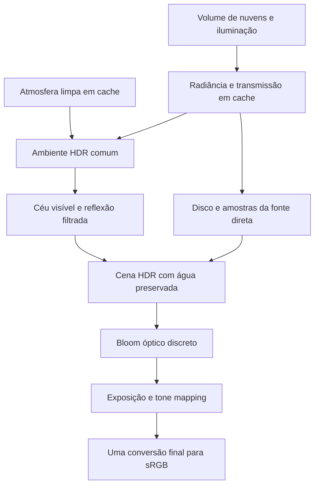

# Oceano — plano de realismo para sol, lua e nuvens

Data: 2026-09-27. Estado: **revisão técnica e plano; sem implementação nesta etapa**. Complementa [P3](OCEAN_P3_IMPLEMENTATION.md). Prioridade: mais realismo no céu, preservando a superfície aprovada, a melhoria das cores e o consumo confortável observado pelo utilizador.

## 1. Feedback e referência

O utilizador considera a água e as cores muito melhores, e o uso de GPU/CPU satisfatório. Identifica duas lacunas: sol e lua parecem pontos, e as nuvens não parecem reais.

As três capturas originais foram guardadas sem edição: [overlay](references/ocean/07-p3-performance-feedback.png), [pôr do sol](references/ocean/08-p3-sunset-feedback.png) e [lua](references/ocean/09-p3-moon-feedback.png). O overlay mostra **GPU 8%, CPU 1%, FPS N/A e LAT N/A**. Isso regista uma observação positiva nessa execução; não determina custo por frame, watts, orçamento disponível ou desempenho noutros equipamentos. As dimensões das capturas não confirmam a resolução interna nem o nível de qualidade selecionado.

A [referência P2 da água](references/ocean/p2-approved-source.sha256) continua protegida. Para comparar cor e iluminação, foi preservado o [estado P3 deste feedback](references/ocean/p3-feedback-source.sha256), com cópia local em `artifacts/ocean-p3/feedback-baseline-20260927`. Essa cópia não substitui controlo de versão. P3 é referência de comparação, não aprovação final dos astros e das nuvens.

## 2. Diagnóstico confirmado no código

| Aspeto observado | Causa na implementação | Consequência para o plano |
| --- | --- | --- |
| Sol/lua como pontos brancos | `SkyPS` desenha um disco uniforme e muito luminoso; `CompositePS` comprime as altas luzes | Trabalhar exposição e resposta óptica antes de aumentar tamanho |
| Lua sem identidade | Mesmo disco uniforme do sol, sem mapa lunar nem distribuição de iluminação pela superfície | Material lunar próprio, com grandes manchas legíveis e fase coerente |
| Nuvens em faixas | `Clouds` usa ruído 2D projetado e esticado, sem volume vertical | Substituir a estrutura das nuvens, além de ajustar a textura |
| Nuvens sem profundidade | Mistura de ambiente e luz direcional sem auto-sombra pelo volume | Espessura, transmissão e iluminação interna |
| Ocultação do astro demasiado simples | `CelestialTransmission` consulta apenas o centro da fonte | Transmissão por direção do disco, também na reflexão |
| Potencial cintilação com céu mais detalhado | O ambiente usa `SampleLevel(...,0)` apesar dos mipmaps existentes | Filtrar o ambiente refletido sem alterar as normais aprovadas |

Evidência: [material/discos/composição](../Shaders/Ocean.hlsl), [formação e luz das nuvens](../Shaders/OceanAtmosphere.hlsl), [parâmetros luminosos](../Services/OceanLightingModel.cs) e [cache](../Services/OceanAtmosphere.cs).

### O tamanho não é o principal erro

O raio atual, 0,00465 rad, corresponde a diâmetro de **0,533°**, da ordem do tamanho aparente real de sol e lua. A NASA descreve ambos como aproximadamente meio grau. [NASA — diâmetro angular](https://eclipse2017.nasa.gov/exploring-angular-diameter).

A câmara atual tem FOV vertical de 42°. Perto do centro da imagem, o diâmetro projetado é aproximadamente `altura × tan(raio angular) / tan(FOV vertical / 2)`: **13 píxeis em 1080p, 23 em 1890p e 26 em 2160p**, antes dos efeitos de posição, amostragem e redimensionamento. São estimativas derivadas do código, não contagem dos píxeis dos anexos.

O disco pequeno precisa de forma luminosa convincente. A lua atual chega ao tone mapping com radiância pré-exposta de milhares; a compressão `L/(1+L)` leva quase todo o disco ao branco. Acrescentar uma textura por si só não resolve isso. Preservar primeiro o tamanho e a câmara de referência. Um enquadramento mais fechado poderá ser comparado depois como opção de composição, sem substituir silenciosamente a vista aprovada.

## 3. Direção recomendada

**Sol com resposta óptica discreta, lua com material e exposição próprios, e nuvens volumétricas calculadas em cache para a câmara fixa.** O campo de ondas permanece igual.

Separar três fenómenos: o disco do astro; a dispersão da sua luz na atmosfera; e o espalhamento óptico na imagem final. Cada um tem uma função e não deve virar uma sobreposição arbitrária de círculos brilhantes.

O bloom é um efeito da imagem final. Não o incorporar no mapa de iluminação e depois aplicá-lo novamente sobre a reflexão.

## 4. Etapas de implementação futura

### R1 — exposição e presença do sol

1. Guardar capturas HDR antes da composição, histograma de luminância e máscaras de diagnóstico dos astros. A/B com a mesma água, câmara e instante; registar a exposição usada.
2. Rever a compressão de altas luzes preservando os meios-tons e o contraste da água. Manter exposição fixa por preset nesta fase, para evitar pulsação num wallpaper.
3. Testar bloom suave em HDR antes do tone mapping, por redução/filtragem/reconstrução em várias escalas. Começar com passes pequenos e resolução reduzida; intensidade e extensão controladas por preset.
4. Aplicar a resposta óptica também aos reflexos suficientemente luminosos. Evitar transformar todo o trilho numa mancha ou perder a leitura das cristas.
5. Conservar direção, raio angular e energia da fonte consistentes entre céu e água. Caso se experimente outro raio, declarar se a comparação mantém radiância ou irradiância; não ampliar apenas o desenho visível.

Bloom pode sugerir a intensidade de uma fonte em saída SDR; convolução óptica mais completa tem custo maior. A documentação da Epic fundamenta a comparação, mas não propõe acrescentar Unreal ao projeto. [Epic — Bloom](https://dev.epicgames.com/documentation/unreal-engine/bloom-in-unreal-engine).

**Saída:** sol percebido como fonte luminosa integrada ao céu, com núcleo e brilho exterior controlados; água continua nítida e sem véu global. Flare em estrela, fantasmas de lente e convolução FFT ficam fora desta primeira etapa.

### R2 — lua reconhecível

1. Representar o disco como a projeção de uma esfera distante com mapa de cor lunar, orientação estável e iluminação própria. Começar com lua cheia; adicionar uma fase gibosa para verificar volume/terminador sem expandir o âmbito para calendário astronómico.
2. Usar um mapa de cerca de 2K como candidato. O [CGI Moon Kit da NASA](https://svs.gsfc.nasa.gov/4720/) fornece mapas derivados de LRO e versões adequadas para renderização. Registar versão, créditos, condições de uso, espaço de cor e mipmaps ao incorporar o ficheiro. Nesta revisão não foi descarregado nem incluído um asset lunar.
3. Ajustar a curva de altas luzes para que as grandes regiões claras/escuras não desapareçam. Com apenas dezenas de píxeis, o objetivo são manchas amplas e um contorno estável; relevo geométrico e mapas 16K não são prioridade.
4. Manter um modo de exposição global como referência. Se a legibilidade simultânea de lua e mar exigir compressão localizada ou compensação artística, documentar a escolha e comparar a imagem sem essa compensação. Não apresentar o resultado como calibração fotométrica absoluta.
5. A distribuição de radiância lunar, incluindo fase, deve alimentar tanto o disco como as amostras da luz refletida e a iluminação noturna do ambiente. Não conservar energia de lua cheia quando a parte iluminada diminuir. As fases decorrem da geometria sol–lua–observador. [NASA — fases lunares](https://science.nasa.gov/moon/moon-phases/).

**Saída:** lua distinguível do sol, com manchas suaves e relevo visual suficiente para a escala, sem perder o reflexo prateado aprovado. Fases adicionais entram depois dessa leitura estar resolvida.

### R3 — nuvens com forma e iluminação, ainda estáticas

Separar o cálculo da atmosfera limpa do cálculo das nuvens. A formação candidata deve combinar cobertura em grande escala, base/topo e espessura definidos, massas de densidade 3D e erosão fina subordinada à forma. Testar primeiro cumulus/stratocumulus; uma camada alta e fina de cirrus pode complementar depois.

Calcular transmissão pela espessura e iluminação até ao sol/lua, com auto-sombra e aproximação controlada de espalhamento múltiplo. Bases sombreadas e bordas iluminadas devem depender da luz e do volume. Não aplicar o mesmo contorno branco a toda nuvem.

A separação entre forma, iluminação e detalhe é sustentada pelo trabalho dos autores de [Horizon Zero Dawn](https://www.guerrilla-games.com/read/the-real-time-volumetric-cloudscapes-of-horizon-zero-dawn). Os custos publicados para outro jogo/hardware não são orçamento deste renderer.

| Técnica | Papel proposto | Limite a avaliar |
| --- | --- | --- |
| Camada 2.5D com espessura e luz direcional | Candidato Leve e nuvens finas; referência de menor custo | Volume e auto-sombra de massas espessas limitados |
| Densidade 3D integrada em cache HDR | **Candidato principal Equilibrado**, adequado à câmara fixa | Custo/picos de reconstrução e aproximação de nuvens distantes |
| Raymarch em baixa resolução com atualização frequente | Candidato Alto quando o movimento justificar | Custo recorrente, reconstrução e risco de rastos |

O segundo caminho também usa raymarch, durante a geração do cache. A escolha é onde e com que frequência calcular o volume. Não é necessário um sistema para voar através das nuvens neste oceano.

**Saída:** uma cena estática já convincente em dia, pôr do sol e lua, sem as faixas atuais. Aumentar apenas oitavas de ruído ou a resolução do mapa não fecha esta etapa.

### R4 — integração dos astros, nuvens e reflexos

- Guardar radiância e transmissão das nuvens de forma compatível com a composição sobre a atmosfera limpa. O disco continua fora do mapa de ambiente para não duplicar a energia da fonte direta; esse mapa também alimenta a reflexão especular e a névoa.
- Consultar transmissão por raio do disco visível e por amostra da fonte na água. Testar nuvem cobrindo um quarto, metade e a totalidade do astro. A amostra central única atual não representa a ocultação parcial.
- Conservar inicialmente as oito amostras da fonte como candidato de custo; comparar com uma referência de muitas amostras. Aumentar a quadratura apenas onde aparecer erro visível ou de energia, sobretudo numa lua parcialmente iluminada/oculta.
- Filtrar o ambiente detalhado por pegada angular do píxel e largura do lóbulo refletido. Avaliar seleção de mip/convolução adequada; mipmaps genéricos sozinhos não representam toda a filtragem especular. Não alterar as normais, deslocamentos ou variância das ondas para esconder aliasing do céu.
- O cache angular é uma aproximação de nuvens distantes. Sombra espacial no mar e paralaxe dependentes de posição ficam para um teste posterior, se houver incoerência perceptível; não inventar manchas escuras móveis sobre a água para simular essa etapa.

**Saída:** astro parcialmente coberto e reflexo respondem ao mesmo estado, sem escurecimento uniforme abrupto, duplicação de luz ou cintilação nova.

### R5 — movimento lento e continuidade

Só animar depois de aprovar uma formação estática. Usar vento coerente e deformação secundária discreta. Ondas, nuvens, visibilidade do astro e reflexão devem depender do mesmo tempo lógico por saída.

Preservar o cache da atmosfera limpa. Para nuvens, comparar cadências candidatas de atualização, por exemplo 1, 2 e 5 Hz, sem assumir que alguma já serve. Interpolar estados apenas se a comparação em movimento não mostrar dissolução dupla; caso contrário, aumentar a cadência ou avaliar compensação de movimento.

Se uma reconstrução for distribuída por vários frames, calcular num recurso separado e publicar um estado completo. A vista e o reflexo devem usar a mesma versão/interpolação. Pausa congela também a atualização e a interpolação das nuvens; retoma não recupera o tempo suspenso. Resize/recriação deve reconstruir o mesmo instante, sem reiniciar a formação.

**Saída:** movimento confortável, sem blocos de cache de épocas diferentes, saltos na pausa ou reflexo atrasado.

### R6 — consolidar os níveis de qualidade

Reduzir primeiro custo/frequência do céu, amostras das nuvens, resolução do cache e pós-processamento. A água aprovada não é a variável de compensação automática para pagar o novo céu.

Escolher Leve/Equilibrado/Alto após comparar imagem e custo. O Equilibrado continua padrão. Nuvens volumétricas por frame, autoexposição contínua, texturas lunares enormes e DLSS não são requisitos de entrada.

## 5. Critérios de aprovação e medição

### Imagem

- Sol integrado à atmosfera e lua reconhecível, sem exigir aumento arbitrário dos discos.
- Nuvens com massas, espessura, sombra interna e bordas naturais, coerentes com a posição da luz.
- Tons dourados/prateados e leitura das ondas preservados; sem retorno das linhas percebidas na P1.
- Comparação em quatro iluminações × três mares × duas vistas. Acrescentar fontes dentro/fora do enquadramento, nuvem fina/espessa e ocultação parcial.
- Testar exposição/bloom isoladamente, a 1080p e 4K, além de retrato/ultrawide. Inspecionar HDR, mipmaps e saída SDR, não apenas brilho médio de PNG.
- Aprovar primeiro um frame completo. Depois rever sequências de 30–60 s, com pausa/retoma e trocas de qualidade, procurando cintilação, rastos e alterações de exposição.

### Preservação

Reutilizar os hashes dos componentes P2 e o readback dos campos espectrais no mesmo instante. Manter uma opção de comparação com a iluminação P3 do feedback. Uma mudança legítima de céu altera os píxeis refletidos; por isso, a igualdade do PNG final não substitui a verificação da superfície.

### Consumo

Registar adaptador, resolução de saída e interna, nível, limite de FPS e quantidade de janelas/monitores. Repetir as condições da prévia que o utilizador considerou confortáveis. Medir separadamente:

| Cenário | O que incluir |
| --- | --- |
| Abertura fria | Compilação, alocação, primeiro céu e primeiro frame visível |
| Mudança de preset/estado de nuvens | Construção do cache, mipmaps, transição e picos |
| Resize/recriação | Novos recursos, eventual recompilação e reconstrução do mesmo instante |
| Animação estável | Ondas, material, céu já pronto, bloom e composição |
| Ponta a ponta | Apresentação, cópia GPU→CPU e GDI da prévia; desktop separado |

O cache atual guarda **somente o preset corrente**: A→B→A reconstrói. O resize real da janela recria o renderer; mudar apenas o nível de resolução interna no mesmo objeto tem comportamento diferente. A sondagem de 0,220 ms da P3 não mede esses caminhos nem a apresentação.

Seguir o protocolo do plano principal: 30 s de aquecimento, 120 s de medição e três repetições; ensaio prolongado de 30 minutos para estabilidade. Reutilizar a meta inicial a 30 FPS: pelo menos 28 FPS efetivos e p95 de intervalo ≤40 ms. Incluir frames de atualização no p95/p99 e registar também o pior frame e a duração de cada reconstrução, para capturar eventos raros. Medir CPU, GPU por passe, memória e energia/temperatura quando disponíveis. Não esconder picos de cache numa média de frames sem atualização.

Inventariar todos os recursos antes de fechar os níveis. Um mapa 2048×512 RGBA16F com mipmaps ocupa cerca de 10,67 MiB lógicos; duplicar o cache das nuvens para publicação segura já exige cerca de 21,34 MiB, além da atmosfera limpa, densidade 3D, bloom e buffers existentes. Esses valores não incluem despesas do driver nem indicam residência real.

O ganho visual e o custo medido decidem o caminho. O overlay de 8%/1% é uma referência de satisfação a preservar, não uma promessa de que novos efeitos terão a mesma utilização.

## 6. Entregas e ordem de revisão

| Entrega | Resultado verificável |
| --- | --- |
| R1 | Comparador exposição/bloom, sol com presença e água sem perda de contraste |
| R2 | Lua cheia e teste giboso, material legível e energia/reflexo coerentes |
| R3 | Formação estática de nuvens com volume; comparação com caminho Leve |
| R4 | Ocultação parcial e reflexão filtrada sobre a mesma água |
| R5 | Movimento/pausa/cache contínuos, sem rastos |
| R6 | Matriz visual, tempos medidos e níveis definidos |

Locais prováveis de alteração futura: `OceanLightingModel` para fontes e exposição; `OceanAtmosphere` para separar caches; novos passes de nuvens e bloom; `SkyPS`, a amostragem da fonte e a composição final. `WaterVS`, espectro e cálculo das normais permanecem como referência aprovada. Os nomes/divisão dos novos ficheiros serão decididos na implementação.

O primeiro trabalho concreto será **R1 e uma prova de lua cheia R2**, com nuvens atuais congeladas para isolar exposição e material. Em seguida, construir a formação estática R3. Não há estimativa de horas nem custo de GPU prometido antes dessa comparação.

Nesta revisão foram feitas inspeção do código, pesquisa primária, análise das capturas e documentação. Não foram modificados shaders, executados novos benchmarks, descarregados assets externos ou alterada a prévia em execução.
