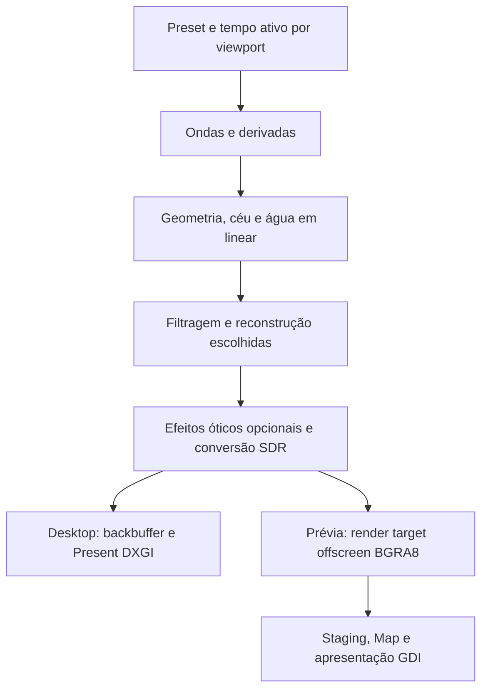

# Oceano — revisão técnica da proposta

Data: 2026-09-27. Revisão B. Base de código e documentação inspecionada: commit `151a015`.

Atualização posterior: o utilizador autorizou a implementação. A [prova P1](OCEAN_P1_IMPLEMENTATION.md) evoluiu para a [água espectral P2, aprovada visualmente pelo utilizador](OCEAN_P2_IMPLEMENTATION.md). Segue-se [P3: cores, sol, lua e céu](OCEAN_P3_LIGHTING_PLAN.md), preservando a superfície. O parecer abaixo conserva o contexto e os limites da revisão anterior à implementação; a aprovação do conjunto final e a validação ampliada permanecem pendentes.

**Estado: revisão e planeamento; não há implementação de Ocean para aprovar.** Este trabalho não implementa shaders, não altera a aplicação e não mede desempenho. Revê o plano anterior perante as seis imagens enviadas pelo utilizador e a prioridade confirmada: equilibrar realismo e consumo com níveis de qualidade.

Documentos associados: [plano revisto](OCEAN_WALLPAPER_PLAN.md), [pesquisa e decisões](OCEAN_RENDERING_RESEARCH.md), [referências visuais e proveniência](references/ocean/README.md).

## 1. Parecer

Manter D3D11/HLSL e um renderer dedicado é uma escolha coerente com o HYPNIX. O plano anterior, porém, não especificava suficientemente os reflexos, a transferência de detalhe entre escalas e a validação em movimento para sustentar a qualidade agora pretendida.

Recomendação: comparar cedo uma superfície espectral direcional, sintetizada por IFFT, com uma superfície Gerstner controlada. A solução espectral é a candidata principal para Equilibrado/Alto; Gerstner é uma referência de comparação e possível solução Económica. A escolha final depende de imagem, estabilidade e custo medidos. FFT é um método de síntese, não uma garantia de realismo; Gerstner também pode representar muitas componentes distribuídas por um espectro.

**Não precisamos de DLSS 5 para produzir estas propriedades da água.** A qualidade base deve existir no renderer, sem dependência de uma marca de GPU. A secção 9 distingue renderização neural, reconstrução de resolução e geração de frames.

## 2. O que as imagens exigem

| Referência | Evidência visual | Consequência técnica |
| --- | --- | --- |
| [01 — escuro/prateado](references/ocean/01-dark-silver.png) | Cristas irregulares, detalhe fino e reflexos brancos sobre água escura | Várias escalas de onda; controlar contraste e reflexo rasante. Branco não prova espuma |
| [02 — escuro/vermelho](references/ocean/02-dark-red.png) | Faixa vermelha fragmentada pelas ondas | Testar continuidade e fragmentação do reflexo. Tratar o vermelho intenso como direção artística, sem inferir uma iluminação física exata |
| [03 — pôr do sol/horizonte](references/ocean/03-sunset-horizon.png) | Astro visível, trilho dourado, primeiro plano escuro e fundo desfocado | Céu e reflexo com a mesma luz; enquadramento com horizonte; profundidade de campo opcional |
| [04 — calmo/dourado](references/ocean/04-calm-gold.png) | Ondulações pequenas e largas regiões douradas, com desfoque | Mar calmo continua a ter estrutura; separar amplitude de onda, detalhe de normal e foco |
| [05 — brilhos em estrela](references/ocean/05-star-glints.png) | Pontos intensos com raios óticos | Tratar raios como efeito de lente/difração ou acabamento artístico; não como geometria ou espuma |
| [06 — reflexos densos/retrato](references/ocean/06-dense-gold.png) | Muitos reflexos pequenos, contraste alto, composição vertical | Filtragem especular e teste em retrato; preservar a densidade aparente sem ruído temporal |

Estas imagens são referências de aparência, não medições de altura de onda, vento, exposição ou movimento. Não permitem identificar o software usado nem garantir equivalência entre uma fotografia/render offline e um wallpaper em tempo real. As cópias conservam marcas de água e elementos de interface; não são assets aprovados para distribuir no produto.

## 3. Achados prioritários

As localizações nesta tabela referem-se ao documento/código no commit de base; os documentos atuais já incorporam as correções propostas. P1 significa risco central para qualidade ou continuidade; P2 significa lacuna relevante de integração ou validação.

| ID | Prioridade e localização na base | Problema e correção requerida |
| --- | --- | --- |
| T01 | P1 — plano §§3, 4.1, 6 | Fixar 4–12 ondas e adiar FFT limita prematuramente a comparação. Introduzir a avaliação espectral multiescala antes de consolidar o material e os níveis |
| T02 | P1 — plano §§4.1–4.2 | Reduzir normais finas por distância pode apagar energia e alterar o trilho de luz. Especificar transferência entre geometria, normais resolvidas e distribuição de microinclinações filtrada |
| T03 | P1 — plano §4.2 | “Luz coerente” e cubemap pequena não definem o reflexo solar/lunar. Definir fonte de tamanho angular finito e evitar contar o mesmo astro no ambiente e na luz direta |
| T04 | P1 — plano §§4.2, 5, 8 | AA como acabamento e Alto limitado antecipadamente a 1440p não sustentam reflexos finos em 4K. Filtragem especular é requisito inicial; resolução final depende de comparação em movimento |
| T05 | P1 — `PerMonitorVisualizerFreezeState.cs`, `WallpaperPreviewControl.cs`, `NativeWallpaperHost.cs` | O freeze atual volta ao tempo global, e a recriação da prévia pode reiniciar o relógio do host. Guardar tempo/fase lógica fora dos recursos e sessões gráficas recriados |
| T06 | P2 — plano §§4.4, 8 e adenda 1.2.2 | A regra genérica “sem readback” contradizia a prévia atual. Documentar desktop DXGI e prévia offscreen→staging→GDI como dois caminhos distintos |
| T07 | P2 — plano §§5–6 | Memória e prazo foram estimados antes deste âmbito visual. Recontar recursos efetivos; retirar os números anteriores como compromisso para esta revisão |
| T08 | P2 — `WallpaperRenderWorker.cs`, `WallpaperSession.cs`, `WallpaperCatalog.cs` | Cadência, áudio e listas de modos GPU não são resolvidos só com um enum Ocean. Medir intervalos reais e tornar capacidades explícitas |

## 4. Superfície, espectro e escala

### 4.1 Contrato do modelo

- Documentar metros, segundos, eixos, direção do vento, convenções de fase e de transformada. Usar seed reproduzível.
- Separar ondulação longa (swell) das ondas geradas pelo vento, com dispersão direcional. “Calmo” e “agitado” não devem resultar apenas de multiplicar toda a altura e acelerar o tempo.
- Escolher e normalizar um espectro com parâmetros documentados. JONSWAP é um candidato a avaliar; não inferir parâmetros numéricos das imagens. Águas rasas, praia e rebentação volumétrica não fazem parte deste modelo de mar aberto.
- Comparar distribuição e energia equivalentes antes de concluir que uma técnica é superior. A IFFT eficiente não corrige um espectro mal calibrado.
- Gerar deslocamento e derivadas coerentes. Se houver deslocamento horizontal para cristas mais agudas, a normal deve considerar também essas derivadas, não apenas o gradiente da altura.
- Limitar e diagnosticar dobragem da parametrização pelo Jacobiano. O limiar de espuma por compressão não transforma uma superfície de altura em simulação de rebentação.

### 4.2 Bandas e amostragem

Para cada banda/cascata, declarar extensão física `L`, resolução `N`, intervalo de comprimentos de onda e janela de combinação. O espaçamento é `L/N`; o limite de Nyquist exige pelo menos duas amostras por comprimento de onda, mas isso não garante uma crista visualmente bem resolvida. Cobertura da malha e resolução do mapa são decisões diferentes.

Uma cascata 256² pode validar a matemática. A comparação visual deve incluir uma configuração de duas ou três bandas como hipótese inicial, com extensões e resoluções escolhidas pelo enquadramento. Não fixar o número final antes das medições. Janelas sobrepostas devem conservar energia, sem contar duas vezes as mesmas componentes. Procurar repetição de tiles também durante animação e em ultrawide.

Usar uma grelha com densidade projetada adequada à câmara, mais densa perto do observador. Uma grelha projetada é candidata; tessellation e clipmaps não são requisitos prévios. Garantir cobertura em retrato, ultrawide, diferentes alturas de câmara e horizonte, incluindo o deslocamento máximo.

### 4.3 Onde vai cada escala

| Escala aparente | Representação candidata | Critério |
| --- | --- | --- |
| Ondas que alteram cristas/silhueta | Deslocamento de geometria | A malha consegue representar a forma sem inversões nem facetas visíveis |
| Ondulações menores, ainda resolvidas no píxel | Derivadas/normais de superfície | Amostragem e filtragem acompanham a projeção e o ângulo de visão |
| Ondulações abaixo do píxel | Distribuição filtrada de microinclinações no material | A energia e largura dos reflexos mantêm continuidade quando o detalhe deixa de ser resolvido |

Não basta fazer mipmap de uma normal e renormalizá-la, nem reduzir todas as normais finas até a superfície ficar lisa. A distribuição de inclinações não resolvidas precisa de influenciar o lóbulo especular. O modelo de NDF e a sua filtragem devem ser matematicamente compatíveis; não transplantar uma fórmula de variância de uma distribuição gaussiana para GGX sem derivação/validação.

Fundamentos: [Bruneton, Neyret e Holzschuch — Real-time Realistic Ocean Lighting using Seamless Transitions from Geometry to BRDF](https://morpho.inrialpes.fr/Publications/2010/BNH10/article.pdf), [Tessendorf — Simulating Ocean Water](https://jtessen.people.clemson.edu/reports/papers_files/coursenotes2002.pdf). São bases para avaliar o desenho, não uma promessa de desempenho no HYPNIX.

### 4.4 Verificação matemática futura

Uma onda isolada deve reproduzir direção e período conhecidos. Comparar derivadas analíticas com diferenças finitas, normalização da transformada com uma referência CPU pequena e variância estatística entre resoluções/bandas. Verificar a simetria conjugada do espectro evoluído que produz o campo real; a construção de `h0` deve seguir a formulação escolhida, sem impor uma restrição incompatível por conveniência. Testar fases após horas de tempo lógico e mudanças suaves de parâmetros.

## 5. Material e iluminação

### 5.1 Sol, lua e céu

Um único estado de iluminação deve definir direção, tamanho angular, radiância/cor e ambiente, tanto para o astro visível como para a água. Sol e lua subtendem aproximadamente meio grau no céu; isto é diâmetro, não raio. A lua reflete luz solar; o aspeto azulado noturno também depende de exposição e tratamento da imagem. Fontes: [NASA — diâmetro angular](https://eclipse2017.nasa.gov/exploring-angular-diameter), [NASA — Moonlight](https://science.nasa.gov/moon/moonlight/).

Proposta para o HYPNIX: céu procedural ou ambiente pré-filtrado para iluminação distribuída, mais contribuição especular de um disco distante finito para sol/lua. A integração desse disco com o material precisa de uma aproximação validada contra amostragem numérica de referência; uma luz pontual extremamente intensa não basta como especificação.

Se o disco for avaliado separadamente, removê-lo da iluminação ambiental usada nesse cálculo. A imagem visível do céu pode continuar a mostrá-lo. A alternativa de incluir tudo num ambiente só é aceitável se resolver e filtrar adequadamente o astro, sem somar novamente a contribuição direta. Uma cubemap 256/512 não constitui, por si só, uma garantia para esse reflexo pequeno e intenso.

O trilho luminoso deve surgir da geometria, normais, visibilidade, distribuição especular e posição da luz. Não pintar uma faixa luminosa fixa na água ou no ecrã. Ao mudar luz/câmara, a faixa deve responder; ao mudar agitação, deve fragmentar-se de forma coerente.

### 5.2 Resposta da água

Usar material dielétrico com IOR próximo de 1,33 e refletância frontal próxima de 2%, Fresnel e termo de mascaramento coerentes. Aplicar Fresnel uma vez por contribuição física, evitando duplicação ao combinar luz e ambiente. [Filament — fundamentos de materiais](https://google.github.io/filament/main/filament.html).

A água precisa de absorção e de uma aproximação controlada à luz que emerge do volume; uma cor difusa azul saturada não deve dominar a resposta. O mar calmo continua a ter ondulações finas. Agitação geométrica e rugosidade microscópica são parâmetros relacionados pelo modelo, mas não equivalentes.

O mascaramento de microfacetas não resolve automaticamente sombras/oclusão entre ondas grandes. Nos testes de luz baixa e mar agitado, procurar brilho que atravessa uma crista oclusora. Se esse erro for relevante, comparar uma aproximação de visibilidade na superfície antes de aceitar o preset. Não há necessidade demonstrada de ray tracing de hardware ou SSR para um oceano sem objetos refletidos.

### 5.3 Cor, exposição e noite

Renderizar em linear com exposição explícita e estável por preset; evitar adaptação automática que faça o brilho “respirar”. Se forem usadas radiâncias físicas, definir pré-exposição para manter os valores dentro do formato HDR escolhido. Histórico temporal e frame atual precisam da mesma referência de exposição ou conversão explícita.

Avaliar `RGBA16F` para cor e `D32_FLOAT` para profundidade, verificando suporte e custo. Definir uma única conversão para saída SDR BGRA8. O tone mapping deve preservar cor e estrutura nos reflexos intensos; não transformar todo o trilho dourado num bloco branco. Noite precisa de detalhe em quase-preto e contraste legível, sem clarear todo o céu para compensar um material incorreto. HDR interno não significa saída HDR do Windows.

## 6. Estabilidade e efeitos óticos

**Filtragem especular é obrigatória desde a primeira comparação visual. TAA é uma opção de implementação, não uma obrigação inicial.** O filtro deve considerar a área projetada do píxel, especialmente alongada em ângulos rasantes. AA de pós-processamento não recupera energia especular que já foi perdida na amostragem do material. [NVIDIA Research — Filtering Distributions of Normals for Shading Antialiasing](https://research.nvidia.com/publication/2016-06_filtering-distributions-normals-shading-antialiasing).

Se for adotado TAA ou reconstrução temporal: gerar vetores de movimento com a superfície atual e anterior, mesmo com câmara parada; tratar desoclusões, mudanças de exposição e reflexos que não acompanham o movimento material. Definir rejeição/clamping de histórico e reset por viewport em cortes, resize e mudanças incompatíveis. Testar fantasmas atrás das cristas e rastos nos brilhos.

Bloom, profundidade de campo e raios em estrela pertencem a uma camada ótica opcional. Bloom e raios em estrela partem dos brilhos renderizados, com intensidade coerente com a exposição; não são partículas aleatórias sobre a água. A profundidade de campo usa profundidade, distância de foco e abertura, e é avaliada separadamente. [PBR Book — Realistic Cameras](https://pbr-book.org/3ed-2018/Camera_Models/Realistic_Cameras).

Aprovar primeiro a imagem com esses efeitos desligados. A profundidade de campo pode ajudar a referência 03/04, mas também esconder erros ou prejudicar leitura do desktop. A referência 05 não exige essa aparência nos restantes presets.

Espuma é outro fenómeno: material de bolhas associado às cristas, com persistência e transporte plausíveis. Os brilhos brancos das referências não justificam ativar espuma generalizada. Validar o mar sem espuma; depois comparar máscara instantânea e histórico. Não usar espuma, blur ou bloom para ocultar problemas da superfície.

## 7. Integração nativa e ciclo de vida

O renderer existente não oferece automaticamente malha 3D, profundidade, vetores de movimento e histórico temporal para Ocean. Esses recursos, quando escolhidos, precisam de contratos próprios.

Esta separação segue [GpuPreviewSurface.cs](../Services/GpuPreviewSurface.cs) e o [registo da versão 1.2.2](DEVELOPMENT_RELEASE_1.2.2.md). Não reintroduzir swap chain HWND na prévia. No desktop, não acrescentar readback por frame; na prévia, medir o readback estrutural e a apresentação GDI. “Mesma imagem” significa mesmo preset, tempo, enquadramento e contrato de cor, não o mesmo mecanismo de apresentação.

O tempo ativo por monitor precisa de sobreviver a pause/resume e recriação da sessão da prévia. Guardar o estado lógico fora do device, render targets e stopwatch do host que podem ser substituídos. Preservar a identidade lógica da saída/prévia em resize e recovery; não usar tamanho ou posição do viewport como identidade do relógio. Pausar não acumula tempo a recuperar; outro monitor pode continuar. Após device loss, reconstruir ondas na fase lógica preservada e reiniciar apenas os históricos gráficos que não puderem ser recuperados.

Registar ownership e vida útil de cada recurso, unbinds SRV/UAV/RTV e libertação em falhas parciais. UI transmite snapshots; contexto imediato e operações gráficas ficam na thread de render. Preservar a preparação assíncrona do primeiro frame e o wallpaper anterior em falha.

O worker atual espera depois de submeter o desenho; o limite nominal não certifica a cadência efetiva. Medir CPU, GPU, Present e intervalo real separadamente antes de corrigir o agendamento. Não presumir que todo o tempo GPU é uma espera síncrona na CPU.

Rever todas as listas de modos GPU, criação/disposição, catálogo e capacidades. Ocean é ambiente sem captura áudio na primeira versão; não herdar automaticamente WASAPI, screen blend, paleta e controlos de posição 2D dos visualizadores.

## 8. Qualidade e desempenho: o que fica em aberto

| Nível | Candidato de superfície | Avaliação de resolução | Invariantes |
| --- | --- | --- | --- |
| Económico | Gerstner ou espectro simplificado, conforme comparação | 720p/1080p internos em saída 1080p/4K | Luz, forma global, fase e filtragem coerentes; efeitos opcionais reduzidos |
| Equilibrado | Espectro direcional multiescala como candidato principal | 1080p/1440p e reconstrução, confrontados com referência | Compromisso medido entre detalhe temporal, memória e consumo |
| Alto | Modelo validado com mais detalhe resolvido | Comparar 1440p reconstruído e 4K nativo | Só aceitar perda de resolução se preservar os reflexos requeridos |

Estes valores são pontos de experiência, não limites aprovados nem garantia de hardware. Um nível não deve reseedar o mar nem provocar saltos nas ondas de grande escala. Partilhar seed entre Gerstner e IFFT não produz automaticamente o mesmo campo: preservar componentes comuns de baixa frequência (vetor de onda, amplitude, fase e relação de dispersão), ou definir uma transição entre campos com energia controlada e continuidade visual validada. Alterar bandas/detalhe exige o mesmo cuidado. Limitar também dimensão máxima, mantendo proporção em retrato/ultrawide.

Antes de aprovar um orçamento de memória, inventariar formato × largura × altura × quantidade, mipmaps, recursos temporários, partilha por device e duplicação por viewport/sessão. Dois backbuffers BGRA8 a 3840×2160 usam cerca de 63,3 MiB; somados a uma cor RGBA16F e profundidade D32 nativas já perfazem aproximadamente 158,2 MiB, antes de ondas, históricos ou drivers. A prévia tem target/staging em vez desses backbuffers; memória alocada, residente na GPU e privada do processo são métricas distintas.

Conservar 30 FPS como recomendação inicial, respeitando a escolha global. Identificar uma iGPU e uma dGPU concretas; medir também duas saídas, prévias simultâneas e pausa parcial. Metas de tempo GPU só valem no hardware/resolução especificados. Percentagem de utilização não mede watts.

## 9. Decisão sobre DLSS

| Tecnologia | Papel | Decisão para este oceano |
| --- | --- | --- |
| DLSS 5 — 3D-Guided Neural Rendering | A NVIDIA descreve uma etapa neural que recebe a imagem do motor e vetores de movimento para modificar iluminação e detalhe de materiais | Não é requisito. Uma experiência futura teria de demonstrar ganho, fidelidade aos presets, estabilidade e custo aceitável |
| DLSS Super Resolution | Reconstrução de imagem de menor resolução | Possível otimização futura em hardware compatível, se houver vantagem medida em 4K; comparar especialmente os brilhos em movimento |
| DLSS Frame Generation | Geração de frames adicionais | Fora do âmbito inicial; não resolve a modelação da água nem constitui a base do objetivo de baixo consumo |

A [publicação oficial da NVIDIA de 22/09/2026](https://developer.nvidia.com/blog/whats-new-for-game-developers-dlss-5-with-3d-guided-neural-rendering-nvidia-ace-updates-and-new-rtx-kit-capabilities/) descreve DLSS 5 como uma etapa sobre o frame já renderizado. Isso não certifica o resultado neste oceano nem determina disponibilidade de integração para o nosso renderer personalizado.

Para Super Resolution, a [documentação de integração da NVIDIA](https://developer.nvidia.com/rtx/streamline/get-started) exige atenção a movimento, jitter e exposição. Precisaríamos também de definir e validar todas as entradas e o ciclo de vida exigidos pela versão escolhida. O suporte genérico D3D11 do Streamline não prova suporte D3D11 para cada funcionalidade, incluindo DLSS 5. Não migrar para D3D12 apenas por essa suposição.

Manter o caminho base independente de DLSS. Não instalar SDKs nem introduzir dependências nesta revisão. Qualquer alternativa temporal, neural ou convencional, deve ser comparada com a mesma imagem base e orçamento total.

## 10. Matriz de aceitação e provas futuras

Validar três estados de mar (calmo, moderado, agitado) cruzados com quatro iluminações (sol alto, pôr do sol, lua, céu difuso): **12 cenas técnicas**. São casos de teste, não obrigação de expor 12 presets na interface. Acrescentar as variantes artísticas vermelha e estrelada depois da base aprovada.

Cobrir vista próxima e vista com horizonte; 16:9, ultrawide e retrato. Comparações técnicas usam seed, câmara, tempo, material e exposição fixos. Rever frames em t=0/10/60/600 s e vídeos de 30–60 s a 15/30/60 FPS, comparando o mesmo instante lógico. Incluir close-ups dos reflexos, horizonte e transições de detalhe.

| Prova | Critério antes de avançar |
| --- | --- |
| Fonte luminosa e material | Posição do astro e do reflexo coerentes; disco não contado duas vezes; exposição sem pulsação; brilho mantém estrutura e cor |
| Espectro e malha | Sem inversões, costuras, bordas ou repetição evidente; escala coerente; derivadas e energia verificadas |
| Reflexos em movimento | Sem rastos persistentes ou ruído de cintilação incoerente; manter glints naturais. Comparar com referência supersampled reduzida para a mesma saída |
| Mudança de qualidade | Continuidade das ondas comuns, sem reseed, degrau de largura/energia do reflexo ou alteração súbita do enquadramento |
| Pausa e recriação | Frame parado estável, retoma contínua, resize/device recovery sem reinício arbitrário da fase |
| Produto | Prévia/desktop coerentes; sem captura áudio; preferências antigas válidas; falha de primeiro frame mantém o wallpaper anterior |
| Consumo | Medição por passe e ponta a ponta, sem bloqueio introduzido pela instrumentação; orçamento aprovado para hardware identificado |

O brilho físico pode cintilar; o objetivo é distinguir essa variação coerente do aliasing. A referência supersampled espacial avalia a integração dentro do píxel. Para análise temporal, definir também subamostras temporais, janela de exposição e FPS de referência, comparando os mesmos instantes e a mesma janela de exposição dos candidatos. Separar o teste espacial instantâneo do teste temporal; não atribuir à filtragem espacial uma melhoria obtida apenas por motion blur. Não exigir imagem artificialmente imóvel nem aprovar apenas por um número de erro de píxel. Medir energia/contraste e complementar com revisão humana em movimento. As tolerâncias finais dependem de referências válidas.

Protocolo: 30 s de aquecimento, 120 s de medição, três repetições e ensaio prolongado de 30 min. Usar timestamps GPU assíncronos, invalidar resultados disjoint e ler queries com atraso. Não usar o polling bloqueante de um smoke curto como benchmark final. Desligar capturas diagnósticas durante medição; o readback necessário à prévia continua presente e contado. Registar adaptador/LUID, driver, energia, resolução interna/saída, FPS, preset, seed e commit.

## 11. Sequência e limites desta aprovação

1. Fechar contratos de luz, escala, amostragem, tempo e recursos; selecionar hardware de referência.
2. Quando a implementação for solicitada, produzir uma prova nativa e um comparador Gerstner/espectral com o mesmo material e filtragem.
3. Aprovar as 12 cenas técnicas em movimento, incluindo brilho solar/lunar e vistas rasantes, antes de acabamento ótico.
4. Definir níveis por medições e só depois consolidar integração, empacotamento e relatório de regressão.

A estimativa anterior de 19–42 h correspondia a outro âmbito e não deve ser usada como compromisso para esta revisão. Reestimar após a prova comparativa, com o custo real de filtragem, bandas e integração identificado. Ainda não é possível certificar fotorealismo, desempenho ou equivalência às referências. Esta revisão reduz decisões frágeis e define como demonstrar o resultado; não substitui essa demonstração.
