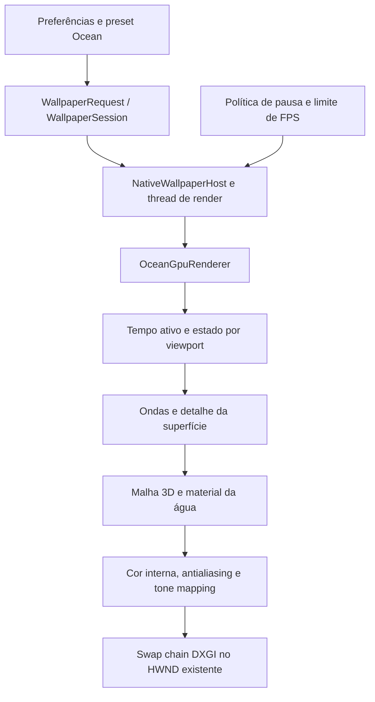

# Oceano 3D em tempo real — plano de implementação

Data: 2026-09-27. Estado: **planeado; nenhum renderer de oceano foi implementado no HYPNIX**.

Prioridade confirmada pelo utilizador: **equilibrar realismo e consumo, com níveis de qualidade**.

Este documento é o plano de execução. A [pesquisa técnica e o registo de decisões](OCEAN_RENDERING_RESEARCH.md) explicam as alternativas e as fontes. Os números de qualidade, memória e tempo abaixo são propostas para validar, não resultados de benchmark.

## 1. Resultado pretendido

Criar um wallpaper original de oceano escuro, com movimento natural, reflexos suaves e detalhe suficiente para parecer água em 1080p e 4K. Deve funcionar na biblioteca, na prévia e no desktop, respeitando as políticas existentes de pausa e os diferentes monitores.

Direção visual inicial: mar aberto, câmara estável próxima da superfície, luz lateral difusa, cores pouco saturadas e espuma discreta. O oceano deve continuar interessante em silêncio e confortável numa utilização prolongada.

O Chaos Pack é uma referência de direção artística. A [página do produto](https://optimum.store/products/chaos-pack) anuncia imagens renderizadas em 8K, pretos para OLED e granulação; não identifica o renderer nem confirma animação. Não existe base para afirmar que usa Blender, Houdini ou uma tecnologia em tempo real. A avaliação desta pesquisa não inclui os ficheiros pagos nem uma comparação visual calibrada com esses ficheiros.

### Entrega inicial

- Um novo wallpaper integrado, com identificador provisório `ocean` e nome de trabalho **Ocean**.
- Renderer nativo D3D11/HLSL, com a mesma imagem e comportamento na prévia e no desktop.
- Três níveis: Económico, Equilibrado e Alto. Equilibrado é o ponto de partida; 30 FPS é a recomendação, mantendo o limite de FPS escolhido na aplicação.
- Controlos de agitação, velocidade e iluminação; espuma quando existir implementação validada.
- Presets visuais originais: começar com um único mar escuro aprovado; acrescentar variações depois.
- Miniatura capturada do renderer real, diagnóstico e testes de integração.

O primeiro âmbito é uma superfície de mar aberto. Rebentação volumétrica, praias, navios, salpicos físicos, câmara subaquática, áudio ambiente e interação com o rato ficam para projetos posteriores. Um campo de superfície não representa sozinho uma onda que se enrola e rebenta.

## 2. O que existe no projeto

Inspeção efetuada sobre a árvore de trabalho em 2026-09-27, que já continha alterações locais. Nesta tarefa são produzidos documentos; as alterações existentes de aplicação e publicação não constituem trabalho deste plano.

| Área | Evidência local | Consequência |
| --- | --- | --- |
| Plataforma | [AnimatedWallPaper.csproj](../AnimatedWallPaper.csproj): WPF/.NET 8, Vortice D3D11 e D3DCompiler 3.8.3 | Reutilizar C#, HLSL e o runtime atual |
| Shaders atuais | [AethelisGpuRenderer.cs](../Services/AethelisGpuRenderer.cs): triângulo de ecrã completo, recursos por viewport, passes adicionais e compute em alguns efeitos | Uma malha de oceano exige um caminho próprio de desenho |
| Renderer dedicado | [FireGpuRenderer.cs](../Services/FireGpuRenderer.cs): superfícies por viewport e resolução interna limitada | Precedente útil para `OceanGpuRenderer` |
| Integração Windows | [NativeWallpaperHost.cs](../Services/NativeWallpaperHost.cs), [WallpaperSession.cs](../Services/WallpaperSession.cs) | Reutilizar HWND, thread de render e preparação do primeiro frame |
| Ciclo de vida | [WallpaperRenderWorker.cs](../Services/WallpaperRenderWorker.cs), [DisplayWallpaperController.cs](../Services/DisplayWallpaperController.cs) | Preservar cancelamento, substituição segura e recuperação |
| Pausa | [PerMonitorVisualizerFreezeState.cs](../Services/PerMonitorVisualizerFreezeState.cs), [PlaybackPolicy.cs](../Services/PlaybackPolicy.cs) | O oceano precisa de congelar superfície e estado temporal por monitor |
| Configuração | [AppSettingsStore.cs](../Services/AppSettingsStore.cs), [VisualizerSettings.cs](../Services/VisualizerSettings.cs) | Há preferências globais, por monitor e presets reutilizáveis |
| Capacidades | [WallpaperCatalog.cs](../Services/WallpaperCatalog.cs), [VisualizerSettingsWindow.xaml.cs](../VisualizerSettingsWindow.xaml.cs) | Separar personalização de reação ao áudio |
| Distribuição | [AssetContractTests.cs](../Tests/Hypnix.Tests/AssetContractTests.cs), [package-portable.ps1](../scripts/package-portable.ps1) | Miniatura 960×540, licença e inventário de assets fazem parte da entrega |

### Pontos que exigem atenção

1. `WallpaperSession` subscreve áudio para qualquer modo diferente de Ambient. Um oceano sem reação ao áudio deve sair dessa regra explícita, sem alterar o comportamento dos visualizadores atuais.
2. `WallpaperEntry.IsVisualizer` considera quase todos os tipos visualizadores; título, descrição e controlos dependem disso. Acrescentar só um enum mostraria controlos inadequados.
3. `VisualizerSettings` não contém parâmetros de oceano. Não converter silenciosamente Sensitivity, Glow ou posição de efeitos 2D em parâmetros físicos.
4. `AethelisGpuRenderer` prefere o adaptador de alto desempenho; `FireGpuRenderer` usa o hardware padrão. A seleção deve ser medida em sistemas híbridos, porque pode acordar a GPU dedicada ou exigir transferência entre adaptadores.
5. O worker espera o intervalo configurado **depois** de renderizar. O limite atual não garante cadência exata de 30/60 FPS quando o desenho fica mais caro. Medir antes de propor uma alteração partilhada de temporização.
6. [Desktop integration findings](DESKTOP_INTEGRATION_FINDINGS.md) contém observações históricas úteis, incluindo uma secção de arquitetura GDI antiga. Para o caminho GPU atual, prevalecem o código e os testes atuais; não replicar indiscriminadamente a recomendação histórica de janela layered.
7. Esse documento regista RTX 5070 Ti/Intel e monitores 4K/1080p numa validação anterior. Isso **não confirma o hardware atual**. A consulta CIM desta pesquisa não teve acesso; identificar os adaptadores por DXGI na prova nativa.

## 3. Caminho recomendado

**D3D11 + renderer dedicado + malha de Gerstner + material de água + resolução interna controlada.** Fazer uma comparação com FFT apenas depois de existir uma referência visual e de desempenho medida.

| Opção | Papel no plano | Justificação |
| --- | --- | --- |
| Gerstner em HLSL | Primeira implementação | Controlo direto, implementação incremental e custo ajustável |
| Espectro + FFT em compute | Evolução condicionada a comparação | Pode enriquecer a distribuição de ondas; acrescenta recursos, sincronização e calibração |
| Three.js/WebGL | Demonstração didática já feita | Não acrescentar um browser ao HYPNIX para uma função que cabe na infraestrutura existente |
| Motor de jogo completo | Fora da arquitetura inicial | Novo runtime e modelo de integração sem necessidade demonstrada |
| Vídeo renderizado | Alternativa futura de produto | Não entrega o mesmo tipo de parametrização em tempo real |

O nível de funcionalidade D3D11 já exigido pelos renderers é 11_0 ou superior. Compute Shader 5.0 está disponível nesse caminho, mas **feature level não mede desempenho**. [Microsoft: feature levels](https://learn.microsoft.com/en-us/windows/win32/direct3d11/overviews-direct3d-11-devices-downlevel-intro).

## 4. Desenho técnico



### 4.1 Geometria e movimento

- Criar uma grelha indexada com vértices estáticos; deslocar os vértices no vertex shader. Guardar camera/view/projection num constant buffer próprio, alinhado a 16 bytes.
- Começar com uma câmara fixa e grelha com maior densidade perto da câmara. Cobrir o campo de visão e ocultar limites distantes com perspetiva/atmosfera; nenhuma borda de tabuleiro pode aparecer nos formatos suportados.
- Usar 4–12 componentes Gerstner, distribuídas em tamanhos e direções diferentes, com seed estável. A direção principal representa o vento, com dispersão secundária controlada.
- Calcular normais a partir das derivadas do deslocamento. A iluminação deve seguir a forma real da superfície.
- Limitar a inclinação combinada para evitar dobragem/inversão da malha. Comprimentos de onda, amplitudes e velocidade precisam de relações coerentes, não valores aleatórios por frame.
- Separar ondas que alteram a silhueta de ondulações finas representadas por normais. Reduzir frequências que a malha ou os píxeis já não conseguem representar à distância.
- Usar metros, segundos e convenções de eixo documentadas no código. Manter o tempo ativo em double no host e enviar fases limitadas por onda; evitar perda de precisão e saltos depois de horas de execução.
- Alterar agitação/velocidade com transições suaves, preservando fases. Trocar a qualidade não deve gerar um novo mar.

A base da técnica e a separação entre geometria e detalhe estão descritas em [GPU Gems: water simulation](https://developer.nvidia.com/gpugems/gpugems/part-i-natural-effects/chapter-1-effective-water-simulation-physical-models). O desenho concreto acima é uma proposta para este projeto.

### 4.2 Material e luz

- Água como material dielétrico, com IOR próximo de 1,33 e refletância frontal próxima de 2%. Usar Fresnel coerente com o ângulo e um lóbulo especular com rugosidade controlável internamente. [Fundamentos do Filament](https://google.github.io/filament/main/filament.html).
- Começar com céu procedural original, usado tanto no fundo como nos reflexos. Uma cubemap local pré-filtrada é uma evolução para melhorar a iluminação.
- Garantir coerência entre a luz visível e a luz refletida. Ajustar primeiro forma, ambiente e exposição, depois espuma e acabamento.
- Cor submersa escura com absorção/aproximação de dispersão; evitar um difuso azul forte que faça a superfície parecer plástico. A primeira versão não precisa de renderizar um fundo submarino.
- Normais de detalhe com mipmaps, atenuação por distância e tratamento de aliasing especular. Reflexos cintilantes devem ser estáveis durante movimento e downsampling.
- Renderizar internamente em cor linear. Candidato: `R16G16B16A16_FLOAT` para cor e `D32_FLOAT` para profundidade, após verificar suporte. Aplicar exposição/tone mapping e uma única conversão de saída para SDR.
- A swap chain atual é `B8G8R8A8_UNorm`; documentar se a conversão linear→sRGB ocorre no shader ou numa view apropriada, impedindo conversão duplicada.
- HDR interno e imagem HDR de iluminação **não significam saída HDR do Windows**. A entrega inicial tem saída SDR; suporte HDR de monitor é um âmbito próprio.
- Sem bloom obrigatório. Introduzir antialiasing espacial simples se necessário; avaliar TAA apenas se persistir cintilação e houver dados de movimento/histórico corretos.

### 4.3 Espuma e estabilidade temporal

Primeiro validar uma superfície sem espuma. Depois acrescentar uma máscara associada à compressão/forma das cristas, com ruído de detalhe e acumulação que decai ao longo do tempo. A documentação de [Ocean Evaluate](https://www.sidefx.com/docs/houdini/nodes/sop/oceanevaluate-.html) confirma a utilidade de acumular e dissipar espuma; não fornece uma implementação pronta para este renderer.

Proposta: duas texturas de feedback por viewport, atualizadas a passo limitado. Cada leitura e escrita usa recursos distintos; desfazer bindings SRV/UAV/RTV antes de trocar funções. A espuma mantém histórico na pausa, é reiniciada controladamente após perda do device e não continua a simular num monitor congelado.

Começar com persistência no domínio da superfície. Avaliar transporte/advecção só se a espuma parecer colada ou deslizar incorretamente. A versão Económica pode omitir o feedback; não apresentar essa aproximação como simulação física completa.

### 4.4 Tempo, recursos e apresentação

- Um contexto imediato D3D11 por thread de render. UI envia snapshots de configuração; não escreve recursos GPU diretamente.
- `OceanGpuRenderer` segue o padrão de `BeginFrame`, `RenderViewport`, `EndFrame` e `Dispose`, com recursos independentes por viewport.
- Preparar shaders, recursos e primeiro frame na thread de render. Reutilizar a espera assíncrona e o limite atual de 15 segundos; falha mantém o wallpaper anterior.
- Libertar recursos na thread e na ordem adequadas, inclusive em inicialização parcial. Não libertar um device ainda utilizado por um worker que não terminou.
- Reutilizar a swap chain flip-model e a associação de janela existente. Evitar readback GPU→CPU no desenho normal; captura de teste pode fazer readback fora do benchmark. [Microsoft: flip model](https://learn.microsoft.com/en-us/windows/win32/direct3ddxgi/for-best-performance--use-dxgi-flip-model).
- Em pausa global, manter a última imagem e estacionar o worker. Um repaint pontual solicitado pelo host é permitido; não manter apresentações periódicas.
- Em pausa por monitor, guardar a imagem e o relógio ativos desse viewport. Outros monitores continuam. No resume, não recuperar o tempo suspenso nem simular centenas de passos de espuma.
- A classe de freeze atual retoma o tempo global ao remover uma pausa por monitor. Criar `OceanFrameClock` para descontar intervalos suspensos e testar o contrato de continuidade, em vez de assumir que a classe atual já o faz.
- Num host com vários viewports, a imagem congelada pode precisar de ser recomposta, mas as ondas/espuma desse viewport não devem ser recalculadas.
- Tratar resize, DPI e mudança de display por recriação controlada, preservando parâmetros e fase lógica quando possível. Perda de device invalida recursos/histórico e deve entrar na recuperação existente, sem ciclos de recriação sem limite.

### 4.5 Configuração e interface

Proposta inicial para evitar uma migração ampla de interfaces:

1. Acrescentar `OceanPreferences? Ocean = null` ao fim de `VisualizerPreferences` e `OceanSettings? Ocean = null` ao fim de `VisualizerSettings`.
2. Normalizar os parâmetros em tipos próprios; JSON antigo sem `Ocean` mantém o comportamento. Preferências por display e presets usam o transporte já existente.
3. Não aumentar indiscriminadamente `AppSettings.SchemaVersion`: o loader atual rejeita valores diferentes de 1. Fazer migração explícita se a forma escolhida exigir versão nova.
4. Adicionar `SupportsCustomization`, `SupportsAudioReaction` e `SupportsOceanControls`. Separar o acesso à janela de personalização do nome `IsVisualizer`.
5. Na v1, Ocean não subscreve WASAPI/microfone nem reage ao áudio. Rever a regra genérica do [guia de autoria](SHADER_WALLPAPER_AUTHORING.md) que exige resposta áudio mesmo de shaders ambiente; o contrato do novo tipo será ambiente, e os visualizadores mantêm os seus testes.
6. Reutilizar a janela de definições, apresentando só controlos efetivos. Qualidade, agitação e velocidade na área de efeitos; iluminação em presets; câmara inicialmente fixa. Manter guardar/restaurar presets.
7. Não aplicar screen blend sobre imagens do utilizador à água. Os controlos de fundo, brilho de efeitos, paleta genérica e posição 2D ficam ocultos para Ocean até terem uma semântica própria implementada.

Valores iniciais propostos: `Quality=Balanced`, `WaveStrength=0.5` no intervalo 0–1, `MotionSpeed=1` no intervalo 0.25–1.5, `LightingPreset=OvercastDark`, `Foam=true` quando suportada pelo nível. Rejeitar NaN/infinito, normalizar enums desconhecidos e manter seed determinística nos presets. Os nomes finais seguem a linguagem atual da aplicação.

## 5. Qualidade, consumo e orçamento

**Hipóteses iniciais de implementação, a ajustar depois do primeiro benchmark.** Resolução interna, malha e atualização da espuma são independentes da resolução do monitor.

| Parâmetro | Económico | Equilibrado | Alto |
| --- | --- | --- | --- |
| Limite inicial de píxeis internos | 1280×720 = 0,92 MP | 1920×1080 = 2,07 MP | 2560×1440 = 3,69 MP |
| Ondas de geometria | 4–6 | 6–8 | 10–12 |
| Malha inicial, segmentos por lado | 96 | 160 | 256 |
| Detalhe fino | 1 camada filtrada | 2 camadas filtradas | 2–3 camadas, conforme custo |
| Espuma | Sem histórico, ou desligada | Feedback até 256² | Feedback até 512² |
| Céu/reflexo | Procedural | Procedural ou cubemap 256 | Cubemap até 512 |
| Meta provisória GPU p95 por viewport | ≤4 ms em iGPU de referência | ≤5 ms em dGPU de referência | ≤8 ms em dGPU de referência |
| Meta de recursos GPU por sessão de teste | ≤64 MiB, saída 1080p | ≤128 MiB, saída 4K | ≤192 MiB, saída 4K |

Os limites de píxeis representam área: `scale = min(1, sqrt(pixelBudget / (width * height)))`. Preservar proporção e impor também limites de dimensão suportados pelo device. Ultrawide e retrato não são esticados nem forçados a 16:9. A malha 256 tem 257² vértices; usar índices de 32 bits nesse caso.

Estes orçamentos **não são garantias de FPS, watts ou compatibilidade numa família inteira de GPUs**. Identificar pelo menos uma iGPU e uma dGPU reais antes de os usar como critérios de lançamento. Sucesso numa RTX não certifica a iGPU.

### Memória e medição

Contabilizar cor interna (`8 × píxeis` para RGBA16F), profundidade (`4 × píxeis` para D32), histórico de espuma, normais, cubemap/mips, buffers de malha e swap chain. Só dois backbuffers BGRA8 em 3840×2160 representam cerca de **63,3 MiB**. Multiplicar pelo número efetivo de sessões/prévias; não confundir resolução interna reduzida com baixo custo total.

Medir separadamente:

- Tempo GPU de ondas/feedback, água e composição final, com timestamp queries e rejeição das amostras disjoint. Ler resultados mais tarde, sem bloquear à espera de cada frame. [Microsoft: validade dos timestamps](https://learn.microsoft.com/en-us/windows/win32/api/d3d11/ns-d3d11-d3d11_query_data_timestamp_disjoint).
- Tempo CPU de preparação/submissão e tempo de espera/Present; p50/p95/p99 dos intervalos de frame.
- Memória GPU contabilizada e memória privada do processo; comportamento após ciclos de criação/destruição.
- Consumo elétrico/temperatura quando existir instrumentação disponível, comparando com desktop parado no mesmo estado. Se não houver medição, marcar como indisponível; percentagem de GPU não equivale a watts.
- Custo total com duas saídas e com prévias simultâneas. Qualidade por viewport não dispensa um orçamento global.

Na v1, oferecer níveis explícitos. Um modo Automático só entra após existir medição fiável: usar histerese e intervalo mínimo entre mudanças, preservar estado e reduzir resolução/detalhe gradualmente. Não oscilar de qualidade a cada frame nem alterar o limite de FPS escolhido sem indicação na interface.

## 6. Fases, dependências e critérios de saída

Todas as fases de implementação estão pendentes. Estimativas representam esforço de trabalho, com incerteza, não uma execução automática agendada.

| Fase | Entrega | Critério para avançar | Estimativa inicial |
| --- | --- | --- | --- |
| P0 — pesquisa | Estes documentos e mapa de integração | Decisões e hipóteses rastreáveis | Concluída nesta tarefa |
| P1 — prova nativa | Grelha animada, câmara, luz simples e captura | Prévia/desktop sem bloqueio, adapter identificado, primeira medição | 1–3 h |
| P2 — superfície | Gerstner, normais, escala e tempo estável | Silhueta natural, sem inversões, repetição óbvia ou salto de pausa | 2–5 h |
| P3 — aparência | Céu/reflexos, Fresnel, cor linear e espuma gradual | Comparação em movimento aprovada e aliasing controlado | 4–8 h |
| P4 — produto | Catálogo, definições, presets, níveis e miniatura | Guardar/reabrir funciona; todos os controlos têm efeito | 3–6 h |
| P5 — desempenho e robustez | Perfis por hardware, falhas e vários monitores | Matriz de validação preenchida, regressões resolvidas | 4–8 h |
| P6 — entrega | Assets e documentação finais, pacote local verificável | Inventário completo e relatório de validação | 1–3 h |
| F1 — FFT, opcional | Comparador espectral com os mesmos materiais | Ganho visível com custo e complexidade aceitáveis | +10–24 h |

P1→P2→P3 formam a sequência visual; P4 depende dos contratos definidos em P1/P2; P5 valida o resultado integrado; P6 só fecha após P5. F1 depende da avaliação em P3 e não bloqueia uma versão Gerstner satisfatória.

Total base: **15–33 h**, com margem de planeamento de aproximadamente 25% (**19–42 h**). Reestimar após P1. A estimativa anterior da conversa, de 2–3 horas para uma versão refinada, foi demasiado otimista para o âmbito agora documentado, que inclui integração, configuração, medição e regressão. Continua a ser plausível chegar a uma prova visual antes de concluir o produto.

### Decisão Gerstner → FFT

Só abrir F1 se uma comparação controlada mostrar padrões repetitivos ou pouca variedade que persistem depois de ajustar ondas e iluminação. Usar a mesma câmara, material, céu, saída e limite de FPS nos dois caminhos. Aceitar FFT se melhorar as imagens em movimento e respeitar o orçamento escolhido; manter Gerstner no nível Económico se necessário.

Experimento FFT proposto: uma cascata 256², espectro simples primeiro, evolução temporal, IFFT separável, mapas de deslocamento/derivadas e o mesmo renderer de superfície. Validar normalização, simetria conjugada, seed e continuidade antes de explorar JONSWAP ou mais cascatas. Bandas de cascatas devem evitar energia duplicada e padrões de repetição visíveis. [Base de Tessendorf](https://jtessen.people.clemson.edu/reports/papers_files/coursenotes2002.pdf).

## 7. Mapa de alterações futuras

Os ficheiros novos abaixo são nomes propostos, não ficheiros já existentes.

| Componente | Trabalho previsto |
| --- | --- |
| `Services/OceanGpuRenderer.cs` | Device/swap chain, passes de céu/água/composição, recursos por viewport e captura de diagnóstico |
| `Services/OceanWaveModel.cs` | Parâmetros, seed e referência CPU pequena para validar derivadas |
| `Services/OceanFrameClock.cs` | Tempo ativo por viewport, pausa e continuidade |
| `Services/OceanSettings.cs`, `OceanQualityPolicy.cs` | Normalização, níveis e orçamentos de píxeis |
| `Shaders/Ocean.hlsl` | VS/PS da superfície, material e sky/composite ou separação em ficheiros quando útil |
| `Shaders/OceanFoam.hlsl` | Feedback opcional; entradas/saídas e formatos documentados |
| `Services/WallpaperKind.cs`, `WallpaperRequest.cs` | Acrescentar Ocean no fim do enum e mapear modo; preservar valores anteriores |
| `Services/NativeWallpaperHost.cs` | Inicializar/desenhar/libertar renderer, atualizar listas GPU, relógios e configurações |
| `Services/WallpaperSession.cs`, `WallpaperCatalog.cs` | Host GPU não layered conforme caminho atual; áudio e personalização por capacidade |
| `Services/VisualizerSettings.cs`, `AppSettingsStore.cs` | Transporte e persistência de configurações específicas |
| `VisualizerSettingsWindow.*`, `MainWindow*.cs`, `WallpaperPreviewControl.cs` | Controlos efetivos e fluxo de preferências para desktop/prévia/monitor |
| `Assets/Wallpapers/ocean/` | Manifesto, `CREDITS.txt`, captura 960×540; recursos locais adicionais se escolhidos |
| `AnimatedWallPaper.csproj`, `scripts/package-portable.ps1` | Incluir novos tipos de assets e Ocean no inventário; confirmar também o pacote MSIX |
| `Tests/Hypnix.Tests/` | Política de qualidade, parâmetros, relógio, persistência e capacidades |
| `Tests/Hypnix.NativeSmoke/OceanRenderChecks.cs`, `Program.cs` | Compilação HLSL, capturas, pausa, recursos e comparações |

A v1 será um built-in. Não alargar a lista de extensões nem permitir HLSL em pacotes importados. O validador atual só suporta o renderer clássico de presets; disponibilizar Ocean como pacote importável seria uma alteração adicional de contrato.

Evitar uma reestruturação ampla de todos os renderers durante a prova. Partilhar utilitários pequenos quando necessário; qualquer extração de backend D3D deve preservar os testes dos efeitos existentes.

## 8. Validação e definição de concluído

### Verificação visual

- Capturar frames com seed fixa em t=0, 10, 60 e 600 s e um vídeo de 30–60 s de cada nível. Usar iluminação e câmara iguais nas comparações técnicas.
- Rever em 1920×1080, 3840×2160, 3440×1440, 5120×1440 e 1080×1920. Resoluções sem monitor físico podem ser ensaiadas offscreen, mas não contam como validação do desktop físico.
- Avaliar silhueta, escala, repetição, deslizamento de reflexos/espuma, cintilação, banding e estabilidade do horizonte. Ver as cristas de perto e a transição para o fundo.
- Inspecionar SDR e, quando disponível, OLED real: pretos sem esmagar todo o detalhe, sem cintilação em quase-preto e brilho confortável. Não declarar suporte OLED validado apenas pela captura PNG.
- A imagem deve funcionar com ícones claros e escuros. Câmara estável e movimento sem flashes são critérios do preset inicial.
- Screenshots confirmam aparência de um instante; vídeo confirma comportamento temporal. Métricas de diferenças de píxeis não certificam realismo.

### Testes dirigidos aos riscos

| Grupo | Critério de aceitação |
| --- | --- |
| Parâmetros | Defaults e presets válidos; limites, NaN/infinito e versões desconhecidas tratados |
| Ondas | Derivadas comparadas com diferenças finitas; sem normais inválidas; inclinação limitada |
| Relógio | 15/30/60 FPS produzem o mesmo estado no mesmo tempo ativo; pausa/retoma sem salto |
| Persistência | Configuração antiga continua válida; preferências globais/monitor/preset restauradas |
| Capacidades | Ocean não abre captura áudio; controlos visíveis têm efeito e os demais ficam ocultos |
| Native smoke | HLSL compila no D3D real; cena animada não fica preta; cada preset produz imagem válida |
| Pausa parcial | Frame do monitor parado fica estável; monitor livre muda; nenhum feedback continua no parado |
| Substituição | Shader/asset inválido, timeout e cancelamento mantêm o wallpaper anterior |
| Recursos | 100 ciclos start/stop/resize sem exceção, device vivo indevido ou crescimento contínuo de recursos |
| Recuperação | Lock/unlock, suspensão, desconexão, DPI e recuperação do Explorer mantêm a aplicação utilizável |
| Formato/pacote | Assets offline presentes; captura 960×540; autoria/licença; galeria/inventário coerentes |

Para testes de imagem, definir tolerâncias a partir de capturas válidas por hardware; não exigir igualdade exata entre drivers. Casos que congelam um frame podem verificar estabilidade dentro da mesma sessão.

### Protocolo de desempenho

Registar OS/build, GPU selecionada, driver, ligação dos monitores, alimentação, resolução física/interna, FPS, preset, seed e commit. Aquecer durante 30 s e medir 120 s sem captura de ecrã/readback. Repetir três vezes e guardar dados brutos e resumo. Fazer também um ensaio de 30 min para memória/temperatura.

Comparar desktop parado, Ocean sozinho, Ocean com prévia, dois monitores independentes e monitor parcialmente congelado. Testar também as prévias múltiplas suportadas pela aplicação. Como meta inicial de cadência a 30 FPS, procurar pelo menos 28 FPS efetivos e p95 de intervalo ≤40 ms; investigar separadamente custo GPU e o temporizador atual se falhar. Validar 15/60 FPS sem assumir que os mesmos orçamentos servem para todas as máquinas.

Não executar testes que mudem o desktop durante a fase de documentação. Na implementação, correr primeiro testes isolados; usar o guia existente para testes de desktop e restauração de preferências.

Comandos existentes para a fase de implementação, a executar na raiz:

```powershell
dotnet build AnimatedWallPaper.csproj -c Release
dotnet test Tests/Hypnix.Tests/Hypnix.Tests.csproj -c Release
dotnet build Tests/Hypnix.NativeSmoke/Hypnix.NativeSmoke.csproj -c Release
dotnet run --project Tests/Hypnix.NativeSmoke/Hypnix.NativeSmoke.csproj -c Release -- artifacts/ocean-validation
```

O último comando só incluirá Ocean depois de o integrar no runner. Se houver binários em uso, aplicar os diretórios de saída isolados descritos no [guia de regressão](TESTING_AND_REGRESSION_GUIDE.md). Não foram corridos builds nem testes GPU nesta tarefa documental.

### Checklist de entrega

- [x] Preferência de equilíbrio entre realismo e consumo confirmada.
- [x] Código e documentação existentes inspecionados; investigação em fontes primárias registada.
- [x] Caminho base, alternativa FFT, fases e critérios documentados.
- [ ] P1: prova nativa e hardware identificados.
- [ ] P2/P3: resultado visual revisto em movimento.
- [ ] P4: integração e configuração concluídas.
- [ ] P5: testes, medições e regressões documentados.
- [ ] P6: assets, créditos, miniatura e pacote local verificados.

## 9. Riscos e como decidir

| Risco | Ação e evidência necessária |
| --- | --- |
| Água parece plástico | Rever céu/Fresnel/normais antes de aumentar geometria; comparação com material constante |
| Ondas repetitivas | Afinar bandas e direções; abrir comparação FFT se persistir |
| 4K consome demasiado | Medir por passe; reduzir píxeis internos/detalhe e limitar trabalho total das prévias |
| Reflexos cintilam | Filtrar normais/ambiente e atenuar frequências; só depois avaliar TAA |
| Espuma parece uma textura fixa | Verificar domínio, persistência e transporte; simplificar até ficar coerente |
| Pausa salta ou altera a imagem | Relógio ativo e histórico próprios, com teste por monitor |
| GPU híbrida custa mais energia | Identificar adaptador/saída e medir cópias; não selecionar GPU apenas pelo nome |
| Regressão no host | Mudanças localizadas, captura de primeiro frame e smoke dos modos existentes |
| Assets faltam no pacote | Rever globs do projeto e filtros do empacotador; abrir build offline |
| Expectativa de rebentação física | Manter referência de mar aberto ou replanear explicitamente um solver diferente |

## 10. Próximo passo concreto

Executar P1: renderer nativo mínimo com um preset escuro, grelha Gerstner, relógio e capturas reproduzíveis. Entregar uma comparação visual e dados de GPU/CPU antes de escolher resoluções finais, HDRI ou FFT.

Na revisão de P1, decidir: enquadramento preferido (mais horizonte ou mais superfície), intensidade do mar, brilho dos reflexos e hardware mínimo que será efetivamente testado. Nenhuma dessas escolhas impede começar a prova técnica.

## Atualização de integração — HYPNIX 1.2.2, 2026-09-27

A prévia GPU passou a renderizar offscreen e apresentar por `GpuPreviewSurface`/GDI, sem swap chain HWND, após o diagnóstico do sino do Windows. O futuro renderer de oceano deve reutilizar essa separação entre prévia e desktop, evitando reintroduzir uma swap chain de janela na prévia. Incluir o custo da transferência GPU→CPU→GDI nas medições com prévias abertas. Esta nota atualiza o contrato de integração; as fases de implementação do oceano continuam pendentes. Ver [registo da 1.2.2](DEVELOPMENT_RELEASE_1.2.2.md).