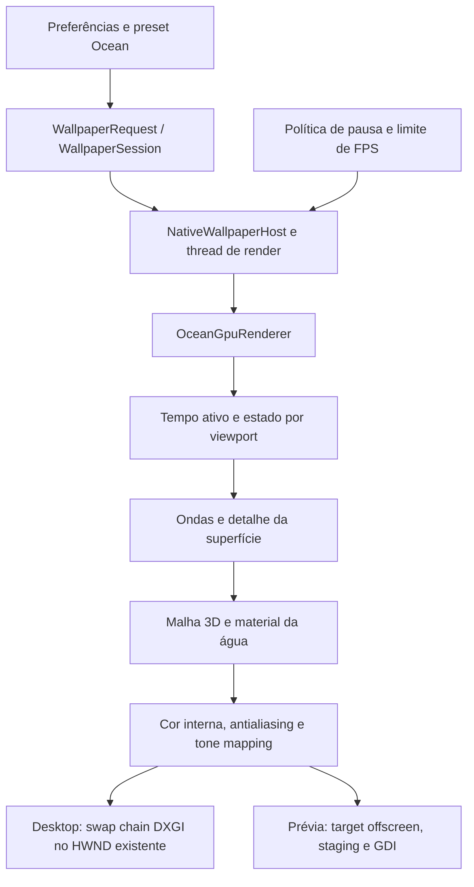

# Oceano 3D em tempo real — plano de implementação

Data: 2026-09-27. Revisão B, com atualizações após as prévias. **Água P2 aprovada; cores P3 melhores e consumo observado satisfatório segundo o utilizador.** A próxima revisão está no [plano de realismo para sol, lua e nuvens](OCEAN_SKY_REALISM_PLAN.md), mantendo a superfície. Ver [P2](OCEAN_P2_IMPLEMENTATION.md) e [P3](OCEAN_P3_IMPLEMENTATION.md). Validação ampliada, integração no produto e aprovação do conjunto final continuam pendentes.

Prioridade confirmada pelo utilizador: **equilibrar realismo e consumo, com níveis de qualidade**.

Atualização de 28/09/2026: ciclo solar/lunar e controles aprovados e salvos em `ed376a5`. A próxima proposta está no [estudo de nuvens, neblina e integração volumétrica](OCEAN_VOLUMETRIC_ENVIRONMENT_STUDY.md), com auditoria do estado atual, fontes, alternativas e critérios de validação. Trata-se de planejamento, ainda sem implementação.

Este documento organiza o trabalho em curso e as etapas futuras. A [revisão técnica](OCEAN_TECHNICAL_REVIEW.md) especifica os requisitos de superfície, luz e estabilidade; a [pesquisa e o registo de decisões](OCEAN_RENDERING_RESEARCH.md) explicam as alternativas e fontes. Resoluções e orçamentos são hipóteses para medir, não benchmarks. DLSS 5 não é requisito; reconstrução de resolução é uma opção futura separada.

## 1. Resultado pretendido

Criar um wallpaper original de mar aberto, calmo a agitado, com iluminação diurna e noturna, reflexos solares/lunares e detalhe convincente em 1080p e 4K. Deve funcionar na biblioteca, na prévia e no desktop, respeitando pausa e diferentes monitores.

Direção visual: câmara estável, enquadramentos próximos e com horizonte, ondas em várias escalas e reflexos fragmentados pela superfície. Usar as [seis imagens de referência](references/ocean/README.md) para avaliar propriedades visuais. O oceano deve continuar confortável numa utilização prolongada; variantes vermelhas e brilhos em estrela são acabamentos artísticos separados.

O Chaos Pack é uma referência de direção artística. A [página do produto](https://optimum.store/products/chaos-pack) anuncia imagens renderizadas em 8K, pretos para OLED e granulação; não identifica o renderer nem confirma animação. Não existe base para afirmar que usa Blender, Houdini ou uma tecnologia em tempo real. A avaliação desta pesquisa não inclui os ficheiros pagos nem uma comparação visual calibrada com esses ficheiros.

### Entrega inicial

- Um novo wallpaper integrado, com identificador provisório `ocean` e nome de trabalho **Ocean**.
- Renderer nativo D3D11/HLSL, com a mesma imagem e comportamento na prévia e no desktop.
- Três níveis: Económico, Equilibrado e Alto. Equilibrado é o ponto de partida; 30 FPS é a recomendação, mantendo o limite de FPS escolhido na aplicação.
- Controlos de agitação, velocidade e iluminação; espuma quando existir implementação validada.
- Validar mar calmo/moderado/agitado sob sol alto, pôr do sol, lua e céu difuso. São 12 cenas técnicas; a quantidade de presets públicos será definida depois.
- Miniatura capturada do renderer real, diagnóstico e testes de integração.

O primeiro âmbito é uma superfície de mar aberto. Rebentação volumétrica, praias, navios, salpicos físicos, câmara subaquática, áudio ambiente e interação com o rato ficam para projetos posteriores. Um campo de superfície não representa sozinho uma onda que se enrola e rebenta.

## 2. O que existe no projeto

Revisão efetuada em 2026-09-27 sobre o commit `151a015`, com árvore limpa antes deste trabalho documental. O plano inicial precedia a consolidação da versão 1.2.2; esta revisão incorpora a prévia offscreen/GDI que já existe nessa base.

| Área | Evidência local | Consequência |
| --- | --- | --- |
| Plataforma | [AnimatedWallPaper.csproj](../AnimatedWallPaper.csproj): WPF/.NET 8, Vortice D3D11 e D3DCompiler 3.8.3 | Reutilizar C#, HLSL e o runtime atual |
| Shaders atuais | [AethelisGpuRenderer.cs](../Services/AethelisGpuRenderer.cs): triângulo de ecrã completo, recursos por viewport, passes adicionais e compute em alguns efeitos | Uma malha de oceano exige um caminho próprio de desenho |
| Renderer dedicado | [FireGpuRenderer.cs](../Services/FireGpuRenderer.cs): superfícies por viewport e resolução interna limitada | Precedente útil para `OceanGpuRenderer` |
| Prévia atual | [GpuPreviewSurface.cs](../Services/GpuPreviewSurface.cs): render target offscreen, staging, Map e GDI | Contar a transferência GPU→CPU na prévia; não criar swap chain HWND nesse caminho |
| Integração Windows | [NativeWallpaperHost.cs](../Services/NativeWallpaperHost.cs), [WallpaperSession.cs](../Services/WallpaperSession.cs) | Reutilizar HWND, thread de render e preparação do primeiro frame |
| Ciclo de vida | [WallpaperRenderWorker.cs](../Services/WallpaperRenderWorker.cs), [DisplayWallpaperController.cs](../Services/DisplayWallpaperController.cs) | Preservar cancelamento, substituição segura e recuperação |
| Pausa | [PerMonitorVisualizerFreezeState.cs](../Services/PerMonitorVisualizerFreezeState.cs), [PlaybackPolicy.cs](../Services/PlaybackPolicy.cs) | O oceano precisa de congelar superfície e estado temporal por monitor |
| Configuração | [AppSettingsStore.cs](../Services/AppSettingsStore.cs), [VisualizerSettings.cs](../Services/VisualizerSettings.cs) | Há preferências globais, por monitor e presets reutilizáveis |
| Capacidades | [WallpaperCatalog.cs](../Services/WallpaperCatalog.cs), [VisualizerSettingsWindow.xaml.cs](../VisualizerSettingsWindow.xaml.cs) | Separar personalização de reação ao áudio |
| Distribuição | [AssetContractTests.cs](../Tests/Hypnix.Tests/AssetContractTests.cs), [package-portable.ps1](../scripts/package-portable.ps1) | Miniatura 960×540, licença e inventário de assets fazem parte da entrega |

### Pontos que exigem atenção

1. `WallpaperSession` subscreve áudio para qualquer modo diferente de Ambient. Um oceano sem reação ao áudio deve sair dessa regra explícita, sem alterar o comportamento dos visualizadores atuais.
2. `WallpaperEntry.IsVisualizer` considera quase todos os tipos visualizadores; título, descrição e controlos dependem disso. Acrescentar só um enum mostraria controlos inadequados.
3. `VisualizerSettings` não contém parâmetros de oceano. Não converter silenciosamente Sensitivity, Glow ou posição de efeitos 2D em parâmetros físicos.
4. `AethelisGpuRenderer` prefere o adaptador de alto desempenho; `FireGpuRenderer` usa o hardware padrão. A seleção deve ser medida em sistemas híbridos, porque pode acordar a GPU dedicada ou exigir transferência entre adaptadores.
5. O worker espera o intervalo configurado **depois** de renderizar. O limite atual não garante cadência exata de 30/60 FPS quando o desenho fica mais caro. Medir antes de propor uma alteração partilhada de temporização.
6. [Desktop integration findings](DESKTOP_INTEGRATION_FINDINGS.md) contém observações históricas úteis, incluindo uma secção de arquitetura GDI antiga. Para o caminho GPU atual, prevalecem o código e os testes atuais; não replicar indiscriminadamente a recomendação histórica de janela layered.
7. Esse documento regista RTX 5070 Ti/Intel e monitores 4K/1080p numa validação anterior. Isso **não confirma o hardware atual**. A consulta CIM desta pesquisa não teve acesso; identificar os adaptadores por DXGI na prova nativa.

## 3. Caminho recomendado

**D3D11 + renderer dedicado + comparação precoce de superfícies + luz e filtragem especular coerentes.** Espectro direcional multiescala sintetizado por IFFT é o candidato principal para Equilibrado/Alto; Gerstner é a referência inicial de comparação e possível caminho Económico. A escolha final depende de imagem em movimento e custo, não apenas do nome da técnica.

| Opção | Papel no plano | Justificação |
| --- | --- | --- |
| Gerstner em HLSL | Referência controlável e candidato Económico | Comparar componentes distribuídas por escala/direção; não assumir que 4–12 ondas bastam para todas as referências |
| Espectro + IFFT em compute | Candidato principal Equilibrado/Alto, avaliado cedo | Distribuição de ondas em várias bandas, com normalização, filtragem e custo a validar |
| Three.js/WebGL | Demonstração didática já feita | Não acrescentar um browser ao HYPNIX para uma função que cabe na infraestrutura existente |
| Motor de jogo completo | Fora da arquitetura inicial | Novo runtime e modelo de integração sem necessidade demonstrada |
| Vídeo renderizado | Alternativa futura de produto | Não entrega o mesmo tipo de parametrização em tempo real |

O nível de funcionalidade D3D11 já exigido pelos renderers é 11_0 ou superior. Compute Shader 5.0 está disponível nesse caminho, mas **feature level não mede desempenho**. [Microsoft: feature levels](https://learn.microsoft.com/en-us/windows/win32/direct3d11/overviews-direct3d-11-devices-downlevel-intro).

## 4. Desenho técnico



### 4.1 Geometria e movimento

- Criar uma grelha indexada com vértices estáticos; deslocar os vértices no vertex shader. Guardar camera/view/projection num constant buffer próprio, alinhado a 16 bytes.
- Começar com uma câmara fixa e grelha com maior densidade perto da câmara. Cobrir o campo de visão e ocultar limites distantes com perspetiva/atmosfera; nenhuma borda de tabuleiro pode aparecer nos formatos suportados.
- Comparar Gerstner com síntese espectral direcional, usando seed, câmara, luz e energia equivalentes. Separar ondulação longa e ondas de vento. Não reduzir “agitação” a altura e velocidade globais.
- Para cada banda, declarar extensão física, resolução, intervalo de comprimentos de onda e janela de combinação. Evitar duplicar energia em bandas sobrepostas; testar repetição espacial e temporal.
- Calcular normais pelas derivadas completas do deslocamento, incluindo deslocamento horizontal. A iluminação deve seguir a superfície; diagnosticar dobragem pelo Jacobiano.
- Limitar a inclinação combinada para evitar dobragem/inversão da malha. Comprimentos de onda, amplitudes e velocidade precisam de relações coerentes, não valores aleatórios por frame.
- Separar geometria, detalhe de normais resolvido e distribuição de microinclinações não resolvidas no material. Filtrar pelo tamanho projetado do píxel, conservando a resposta especular quando muda a escala. Não simplesmente apagar frequências finas; seguir o contrato da revisão técnica §4.
- Usar metros, segundos e convenções de eixo documentadas no código. Manter o tempo ativo em double no estado lógico persistente por saída/viewport, independente da sessão e do host; o host recebe snapshots desse estado. Enviar fases limitadas por onda, evitando perda de precisão depois de horas de execução.
- Alterar agitação/velocidade com transições suaves, preservando fases. Trocar a qualidade não deve gerar um novo mar. Seed igual não basta entre Gerstner e IFFT: partilhar componentes longas com vetor de onda, amplitude, fase e dispersão comuns, ou validar uma transição entre campos com energia controlada.

A base da técnica e a separação entre geometria e detalhe estão descritas em [GPU Gems: water simulation](https://developer.nvidia.com/gpugems/gpugems/part-i-natural-effects/chapter-1-effective-water-simulation-physical-models). O desenho concreto acima é uma proposta para este projeto.

### 4.2 Material e luz

- Água como material dielétrico, com IOR próximo de 1,33 e refletância frontal próxima de 2%. Usar Fresnel coerente com o ângulo e um lóbulo especular com rugosidade controlável internamente. [Fundamentos do Filament](https://google.github.io/filament/main/filament.html).
- Definir um estado comum para céu e reflexo: direção, cor/radiância e tamanho angular do sol/lua. Avaliar um disco distante de tamanho finito, integrado com o material, mais céu procedural ou ambiente pré-filtrado.
- Se o astro for calculado separadamente, excluí-lo da contribuição ambiental correspondente. Evitar dupla contagem e validar a aproximação contra amostragem de referência. O trilho surge da água/luz, não de uma máscara pintada.
- Cor submersa escura com absorção/aproximação de dispersão; evitar um difuso azul forte que faça a superfície parecer plástico. A primeira versão não precisa de renderizar um fundo submarino.
- Filtrar a distribuição de normais/microinclinações com um modelo compatível com a BRDF escolhida. Mipmaps de normais sozinhos não garantem preservação do reflexo. Avaliar visibilidade entre ondas grandes sob luz baixa; mascaramento de microfacetas não a substitui.
- Renderizar internamente em cor linear. Candidato: `R16G16B16A16_FLOAT` para cor e `D32_FLOAT` para profundidade, após verificar suporte. Definir pré-exposição quando necessária para evitar overflow, exposição estável por preset, tone mapping e uma única conversão de saída para SDR.
- A swap chain atual é `B8G8R8A8_UNorm`; documentar se a conversão linear→sRGB ocorre no shader ou numa view apropriada, impedindo conversão duplicada.
- HDR interno e imagem HDR de iluminação **não significam saída HDR do Windows**. A entrega inicial tem saída SDR; suporte HDR de monitor é um âmbito próprio.
- Filtragem especular é obrigatória desde a prova visual. TAA é uma opção a comparar: exige superfície anterior/atual, movimento, rejeição de histórico e tratamento de desoclusões/reflexos. A câmara parada não torna a água estática.
- Bloom, profundidade de campo e raios em estrela são opcionais, avaliados depois da base sem esses efeitos. Não confundir brilhos especulares com espuma.

### 4.3 Espuma e estabilidade temporal

Primeiro validar uma superfície sem espuma. Depois acrescentar uma máscara associada à compressão/forma das cristas, com ruído de detalhe e acumulação que decai ao longo do tempo. A documentação de [Ocean Evaluate](https://www.sidefx.com/docs/houdini/nodes/sop/oceanevaluate-.html) confirma a utilidade de acumular e dissipar espuma; não fornece uma implementação pronta para este renderer.

Proposta: duas texturas de feedback por viewport, atualizadas a passo limitado. Cada leitura e escrita usa recursos distintos; desfazer bindings SRV/UAV/RTV antes de trocar funções. A espuma mantém histórico na pausa, é reiniciada controladamente após perda do device e não continua a simular num monitor congelado.

Começar com persistência no domínio da superfície. Avaliar transporte/advecção só se a espuma parecer colada ou deslizar incorretamente. A versão Económica pode omitir o feedback; não apresentar essa aproximação como simulação física completa.

### 4.4 Tempo, recursos e apresentação

- Um contexto imediato D3D11 por thread de render. UI envia snapshots de configuração; não escreve recursos GPU diretamente.
- `OceanGpuRenderer` segue o padrão de `BeginFrame`, `RenderViewport`, `EndFrame` e `Dispose`, com recursos independentes por viewport.
- Preparar shaders, recursos e primeiro frame na thread de render. Reutilizar a espera assíncrona e o limite atual de 15 segundos; falha mantém o wallpaper anterior.
- Libertar recursos na thread e na ordem adequadas, inclusive em inicialização parcial. Não libertar um device ainda utilizado por um worker que não terminou.
- No desktop, reutilizar swap chain flip-model e evitar readback por frame. Na prévia, usar `GpuPreviewSurface`: offscreen→staging→Map→GDI, sem swap chain HWND. Medir esse readback estrutural; capturas diagnósticas adicionais ficam fora do benchmark. [Microsoft: flip model](https://learn.microsoft.com/en-us/windows/win32/direct3ddxgi/for-best-performance--use-dxgi-flip-model).
- Em pausa global, manter a última imagem e estacionar o worker. Um repaint pontual solicitado pelo host é permitido; não manter apresentações periódicas.
- Em pausa por monitor, guardar a imagem e o relógio ativos desse viewport. Outros monitores continuam. No resume, não recuperar o tempo suspenso nem simular centenas de passos de espuma.
- A classe de freeze atual retoma o tempo global ao remover uma pausa por monitor. Criar `OceanFrameClock` para descontar intervalos suspensos e testar o contrato de continuidade, em vez de assumir que a classe atual já o faz.
- Num host com vários viewports, a imagem congelada pode precisar de ser recomposta, mas as ondas/espuma desse viewport não devem ser recalculadas.
- Tratar resize, DPI e mudança de display por recriação controlada. Guardar tempo/fase lógica fora da sessão/host e dos recursos que podem ser recriados na prévia. Perda de device invalida históricos GPU, mas não deve reseedar ou reiniciar arbitrariamente o mar; recuperação limitada e explícita.

### 4.5 Configuração e interface

Proposta inicial para evitar uma migração ampla de interfaces:

1. Acrescentar `OceanPreferences? Ocean = null` ao fim de `VisualizerPreferences` e `OceanSettings? Ocean = null` ao fim de `VisualizerSettings`.
2. Normalizar os parâmetros em tipos próprios; JSON antigo sem `Ocean` mantém o comportamento. Preferências por display e presets usam o transporte já existente.
3. Não aumentar indiscriminadamente `AppSettings.SchemaVersion`: o loader atual rejeita valores diferentes de 1. Fazer migração explícita se a forma escolhida exigir versão nova.
4. Adicionar `SupportsCustomization`, `SupportsAudioReaction` e `SupportsOceanControls`. Separar o acesso à janela de personalização do nome `IsVisualizer`.
5. Na v1, Ocean não subscreve WASAPI/microfone nem reage ao áudio. Rever a regra genérica do [guia de autoria](SHADER_WALLPAPER_AUTHORING.md) que exige resposta áudio mesmo de shaders ambiente; o contrato do novo tipo será ambiente, e os visualizadores mantêm os seus testes.
6. Reutilizar a janela de definições, apresentando só controlos efetivos. Qualidade, agitação e velocidade na área de efeitos; iluminação em presets; câmara inicialmente fixa. Manter guardar/restaurar presets.
7. Não aplicar screen blend sobre imagens do utilizador à água. Os controlos de fundo, brilho de efeitos, paleta genérica e posição 2D ficam ocultos para Ocean até terem uma semântica própria implementada.

Valores iniciais propostos: `Quality=Balanced`, `WaveStrength=0.5` no intervalo 0–1, `MotionSpeed=1` no intervalo 0.25–1.5, `LightingPreset=OvercastDark`, `Foam=true` quando suportada pelo nível. Rejeitar NaN/infinito, normalizar enums desconhecidos e manter seed determinística nos presets. Os nomes finais seguem a linguagem atual da aplicação.

## 5. Qualidade, consumo e orçamento

**Pontos de comparação, não configurações aprovadas.** Resolução interna, densidade de malha, bandas e espuma devem ser escolhidas juntas pela qualidade em movimento e pelo custo medido.

| Parâmetro | Económico | Equilibrado | Alto |
| --- | --- | --- | --- |
| Resoluções internas a comparar | 720p / 1080p | 1080p / 1440p | 1440p reconstruído / 4K nativo |
| Superfície candidata | Gerstner ou espectro simplificado | Espectro multiescala | Espectro multiescala com mais detalhe resolvido |
| Malha | Densidade projetada validada | Densidade projetada validada | Densidade projetada validada |
| Detalhe subpíxel | Distribuição especular filtrada | Distribuição especular filtrada | Distribuição especular filtrada |
| Espuma e ótica | Desligadas ou simplificadas | Opcionais, conforme ganho/custo | Opcionais, conforme ganho/custo |
| Céu/reflexo | Mesmo contrato de luz | Mesmo contrato de luz | Mesmo contrato de luz |
| Meta GPU p95 por viewport a investigar | ≤4 ms numa iGPU identificada | ≤5 ms numa dGPU identificada | ≤8 ms numa dGPU identificada |
| Memória | Inventário antes do limite | Inventário antes do limite | Inventário antes do limite |

Quando escolhido um orçamento de píxeis, aplicar `scale = min(1, sqrt(pixelBudget / (width * height)))`. Preservar proporção e impor limites de dimensão suportados pelo device. Ultrawide e retrato não são esticados nem forçados a 16:9. Dimensionar índices pela quantidade efetiva de vértices. O nível Alto não fica antecipadamente limitado a 1440p: a comparação em saída 4K decide.

Estes orçamentos **não são garantias de FPS, watts ou compatibilidade numa família inteira de GPUs**. Identificar pelo menos uma iGPU e uma dGPU reais antes de os usar como critérios de lançamento. Sucesso numa RTX não certifica a iGPU.

### Memória e medição

Contabilizar formato, dimensões, quantidade, mips, vida útil e ownership de cada textura/buffer: cor, profundidade, bandas/FFT, derivadas, normais, ambiente, espuma e históricos temporais quando existirem. Dois backbuffers BGRA8 em 3840×2160 representam **63,3 MiB**; somados a cor RGBA16F e profundidade D32 nativas chegam a **158,2 MiB** antes dos restantes recursos. Na prévia, contar target/staging em vez de swap chain. Distinguir alocação, residência GPU e memória privada; multiplicar por sessões/viewports reais e explicar o que é partilhado.

Medir separadamente:

- Tempo GPU de ondas/feedback, água e composição final, com timestamp queries e rejeição das amostras disjoint. Ler resultados mais tarde, sem bloquear à espera de cada frame. [Microsoft: validade dos timestamps](https://learn.microsoft.com/en-us/windows/win32/api/d3d11/ns-d3d11-d3d11_query_data_timestamp_disjoint).
- Tempo CPU de preparação/submissão e tempo de espera/Present; p50/p95/p99 dos intervalos de frame.
- Memória GPU contabilizada e memória privada do processo; comportamento após ciclos de criação/destruição.
- Consumo elétrico/temperatura quando existir instrumentação disponível, comparando com desktop parado no mesmo estado. Se não houver medição, marcar como indisponível; percentagem de GPU não equivale a watts.
- Custo total com duas saídas e com prévias simultâneas. Qualidade por viewport não dispensa um orçamento global.

Na v1, oferecer níveis explícitos. Um modo Automático só entra após existir medição fiável: usar histerese e intervalo mínimo entre mudanças, preservar estado e reduzir resolução/detalhe gradualmente. Não oscilar de qualidade a cada frame nem alterar o limite de FPS escolhido sem indicação na interface.

## 6. Fases, dependências e critérios de saída

A prova técnica P1 foi implementada após o pedido de criar a primeira animação. P2 tem comparação espectral/analítica implementada, matemática testada e superfície aprovada visualmente pelo utilizador. Os testes ampliados continuam pendentes, sem impedir o avanço visual para P3 com a água preservada. P3 prioriza cores, sol, lua e céu; P4–P6 continuam pendentes. A estimativa da revisão anterior foi retirada como compromisso para o âmbito visual ampliado.

| Fase | Entrega futura | Critério para avançar |
| --- | --- | --- |
| P0 — revisão | Plano B, fontes, referências e contratos | Concluída documentalmente; desempenho e imagem ainda não validados |
| P1 — prova nativa | Entregue: superfície, luz, relógio, janela e testes dirigidos | Prévia GDI e saída DXGI oculta verificadas; integração no desktop físico ainda pendente |
| P2 — comparação de superfície | Água espectral aprovada na prévia; testes matemáticos passaram; referência preservada | Avançar para iluminação mantendo a água; concluir verificações ampliadas sem recalibração visual não motivada |
| P3 — aparência | Primeira revisão implementada; cores e consumo bem recebidos; [refinamento de astros/nuvens planeado](OCEAN_SKY_REALISM_PLAN.md) | Aprovar presença dos astros, forma/iluminação das nuvens e continuidade, preservando a superfície |
| P4 — produto | Catálogo, definições, presets, níveis e miniatura | Capacidades, persistência e todos os controlos corretos |
| P5 — desempenho e robustez | Perfis por hardware, falhas e vários monitores | Matriz preenchida, custos conhecidos, regressões resolvidas |
| P6 — entrega | Assets e documentação finais, pacote local | Inventário completo e relatório de validação |

P1→P2→P3 formam a sequência visual, com luz e filtragem já presentes em P2. P4 depende desses contratos; P5 valida o resultado integrado; P6 só fecha após P5. A comparação espectral faz parte de P2, em vez de uma extensão tardia F1.

A previsão anterior de 15–33 h, ou 19–42 h com margem, correspondia a um primeiro preset mais restrito e não vale como prazo desta revisão. A indicação inicial de 2–3 h também não sustentava o produto completo. Reestimar depois de P2, com técnica, filtragem, recursos e hardware definidos; não prometer fotorealismo num prazo ainda sem evidência.

### Comparação Gerstner / espectro

Usar a mesma câmara, material, céu, exposição, energia, saída e limite de FPS nos dois caminhos. Comparar padrões, variedade, glints e estabilidade. Escolher espectro/IFFT se o ganho justificar o custo; uma solução Gerstner satisfatória também pode ser aprovada. O número de componentes não é critério de qualidade por si só.

Uma cascata 256² serve para verificar IFFT e derivadas; a prova visual inclui duas/três bandas como hipótese a dimensionar. Documentar extensão/resolução e janelas, normalizar energia e verificar simetria conjugada do espectro evoluído, seed e continuidade. JONSWAP é candidato, não escolha certificada. A [revisão §4](OCEAN_TECHNICAL_REVIEW.md#4-superfície-espectro-e-escala) especifica os critérios e as fontes matemáticas.

## 7. Mapa de alterações futuras

Os ficheiros novos abaixo são nomes propostos, não ficheiros já existentes.

| Componente | Trabalho previsto |
| --- | --- |
| `Services/OceanGpuRenderer.cs` | Device, saídas desktop/prévia distintas, passes, recursos por viewport e captura de diagnóstico |
| `Services/OceanWaveModel.cs` | Parâmetros, seed e referência CPU pequena para validar derivadas |
| `Services/OceanFrameClock.cs` | Tempo ativo por viewport, pausa e continuidade |
| `Services/OceanSettings.cs`, `OceanQualityPolicy.cs` | Normalização, níveis e orçamentos de píxeis |
| `Shaders/Ocean.hlsl` | VS/PS da superfície, material e sky/composite ou separação em ficheiros quando útil |
| `Shaders/OceanFoam.hlsl` | Feedback opcional; entradas/saídas e formatos documentados |
| `Shaders/OceanSpectrum.hlsl`, `Shaders/OceanFft.hlsl` | Candidatos para evolução espectral/IFFT; nomes e divisão finais dependem de P2 |
| `Services/WallpaperKind.cs`, `WallpaperRequest.cs` | Acrescentar Ocean no fim do enum e mapear modo; preservar valores anteriores |
| `Services/NativeWallpaperHost.cs` | Inicializar/desenhar/libertar renderer, atualizar listas GPU, relógios e configurações |
| `Services/WallpaperSession.cs`, `WallpaperCatalog.cs` | Host GPU não layered conforme caminho atual; áudio e personalização por capacidade |
| `Services/VisualizerSettings.cs`, `AppSettingsStore.cs` | Transporte e persistência de configurações específicas |
| `VisualizerSettingsWindow.*`, `MainWindow*.cs`, `WallpaperPreviewControl.cs` | Controlos efetivos e fluxo de preferências para desktop/prévia/monitor |
| `Assets/Wallpapers/ocean/` | Manifesto, `CREDITS.txt`, captura 960×540; recursos locais adicionais se escolhidos |
| `AnimatedWallPaper.csproj`, `scripts/package-portable.ps1` | Incluir novos tipos de assets e Ocean no inventário; confirmar também o pacote MSIX |
| `Tests/Hypnix.Tests/` | Política de qualidade, parâmetros, relógio, persistência e capacidades |
| `Tests/Hypnix.NativeSmoke/OceanRenderChecks.cs`, `Program.cs` | Compilação HLSL, capturas, pausa, recursos e comparações |

A v1 será um built-in. Não alargar a lista de extensões nem permitir HLSL em pacotes importados. O validador atual só suporta o renderer clássico de presets; disponibilizar Ocean como pacote importável seria uma alteração adicional de contrato.

Evitar uma reestruturação ampla de todos os renderers durante a prova. Partilhar utilitários pequenos quando necessário; qualquer extração de backend D3D deve preservar os testes dos efeitos existentes.

## 8. Validação e definição de concluído

### Verificação visual

- Capturar frames com seed fixa em t=0, 10, 60 e 600 s e um vídeo de 30–60 s de cada nível. Usar iluminação e câmara iguais nas comparações técnicas.
- Cruzar três estados de mar com sol alto, pôr do sol, lua e céu difuso. Avaliar cenas próximas e com horizonte; adicionar variantes artísticas depois da base.
- Comparar os brilhos com referência supersampled espacial reduzida para a mesma saída. Para aliasing temporal, definir também amostragem temporal, janela de exposição e FPS comuns; não confundir ganho espacial com motion blur. Analisar energia, largura do trilho e rastos, distinguindo cintilação física coerente de aliasing.
- Rever em 1920×1080, 3840×2160, 3440×1440, 5120×1440 e 1080×1920. Resoluções sem monitor físico podem ser ensaiadas offscreen, mas não contam como validação do desktop físico.
- Avaliar silhueta, escala, repetição, deslizamento de reflexos/espuma, cintilação, banding e estabilidade do horizonte. Ver as cristas de perto e a transição para o fundo.
- Inspecionar SDR e, quando disponível, OLED real: pretos sem esmagar todo o detalhe, sem cintilação em quase-preto e brilho confortável. Não declarar suporte OLED validado apenas pela captura PNG.
- A imagem deve funcionar com ícones claros e escuros. Câmara estável e movimento sem flashes são critérios do preset inicial.
- Screenshots confirmam aparência de um instante; vídeo confirma comportamento temporal. Métricas de diferenças de píxeis não certificam realismo.

### Testes dirigidos aos riscos

| Grupo | Critério de aceitação |
| --- | --- |
| Parâmetros | Defaults e presets válidos; limites, NaN/infinito e versões desconhecidas tratados |
| Ondas | Derivadas e IFFT comparadas com referências pequenas; energia entre resoluções/bandas; sem normais inválidas, costuras ou dobragem |
| Relógio | Ondas analíticas em 15/30/60 FPS coincidem no mesmo tempo ativo; feedback dentro de tolerância; pausa/retoma e recriação da prévia sem salto |
| Persistência | Configuração antiga continua válida; preferências globais/monitor/preset restauradas |
| Capacidades | Ocean não abre captura áudio; controlos visíveis têm efeito e os demais ficam ocultos |
| Native smoke | HLSL compila no D3D real; cena animada não fica preta; cada preset produz imagem válida |
| Pausa parcial | Frame do monitor parado fica estável; monitor livre muda; nenhum feedback continua no parado |
| Substituição | Shader/asset inválido, timeout e cancelamento mantêm o wallpaper anterior |
| Recursos | 100 ciclos start/stop/resize sem exceção, device vivo indevido ou crescimento contínuo de recursos |
| Recuperação | Lock/unlock, suspensão, desconexão, DPI e recuperação do Explorer mantêm a aplicação utilizável |
| Formato/pacote | Assets offline presentes; captura 960×540; autoria/licença; galeria/inventário coerentes |

Para testes de imagem, definir tolerâncias a partir de capturas válidas por hardware; não exigir igualdade exata entre drivers. Casos que congelam um frame podem verificar estabilidade dentro da mesma sessão.

### Protocolo de desempenho

Registar OS/build, GPU/LUID selecionado, driver, ligação dos monitores, alimentação, resolução física/interna, FPS, preset, seed e commit. Aquecer 30 s e medir 120 s sem capturas diagnósticas adicionais; o readback estrutural da prévia continua ativo e contado. Repetir três vezes, guardar dados brutos e fazer ensaio de 30 min para memória/temperatura. Usar queries assíncronas sem polling bloqueante por frame.

Comparar desktop parado, Ocean sozinho, Ocean com prévia, dois monitores independentes e monitor parcialmente congelado. Testar também as prévias múltiplas suportadas pela aplicação. Como meta inicial de cadência a 30 FPS, procurar pelo menos 28 FPS efetivos e p95 de intervalo ≤40 ms; investigar separadamente custo GPU e o temporizador atual se falhar. Validar 15/60 FPS sem assumir que os mesmos orçamentos servem para todas as máquinas.

Não executar testes que mudem o desktop durante a fase de documentação. Na implementação, correr primeiro testes isolados; usar o guia existente para testes de desktop e restauração de preferências.

Comandos existentes para a fase de implementação, a executar na raiz:

```powershell
dotnet build AnimatedWallPaper.csproj -c Release
dotnet test Tests/Hypnix.Tests/Hypnix.Tests.csproj -c Release
dotnet build Tests/Hypnix.NativeSmoke/Hypnix.NativeSmoke.csproj -c Release
dotnet run --project Tests/Hypnix.NativeSmoke/Hypnix.NativeSmoke.csproj -c Release -- artifacts/ocean-validation
```

O último comando só incluirá Ocean depois de o integrar no runner. Se houver binários em uso, aplicar os diretórios de saída isolados descritos no [guia de regressão](TESTING_AND_REGRESSION_GUIDE.md). Não foram corridos builds nem testes GPU nesta tarefa documental.

### Checklist de entrega

- [x] Preferência de equilíbrio entre realismo e consumo confirmada.
- [x] Código e documentação existentes inspecionados; investigação em fontes primárias registada.
- [x] Revisão B: comparação espectral precoce, luz finita, filtragem, integração e critérios documentados.
- [x] P1: prova nativa, primeira animação e hardware identificados; limites registados no relatório P1.
- [x] P2: água aprovada pelo utilizador na prévia; ausência percebida das linhas registada e referência preservada.
- [ ] P2: concluir matriz ampliada de estabilidade, transições e desempenho.
- [ ] P3: cores, sol, lua, céu e reflexos revistos e aprovados em conjunto.
- [ ] P4: integração e configuração concluídas.
- [ ] P5: testes, medições e regressões documentados.
- [ ] P6: assets, créditos, miniatura e pacote local verificados.

## 9. Riscos e como decidir

| Risco | Ação e evidência necessária |
| --- | --- |
| Água parece plástico | Rever céu/Fresnel/normais antes de aumentar geometria; comparação com material constante |
| Ondas repetitivas | Comparar cedo Gerstner/espectro, distribuição, bandas, extensões e direções |
| 4K consome demasiado | Medir por passe; reduzir píxeis internos/detalhe e limitar trabalho total das prévias |
| Reflexos cintilam | Filtrar distribuição especular e fonte luminosa; conferir amostragem/energia antes de avaliar reconstrução temporal |
| Espuma parece uma textura fixa | Verificar domínio, persistência e transporte; simplificar até ficar coerente |
| Pausa salta ou altera a imagem | Relógio ativo e histórico próprios, com teste por monitor |
| GPU híbrida custa mais energia | Identificar adaptador/saída e medir cópias; não selecionar GPU apenas pelo nome |
| Regressão no host | Mudanças localizadas, captura de primeiro frame e smoke dos modos existentes |
| Assets faltam no pacote | Rever globs do projeto e filtros do empacotador; abrir build offline |
| Expectativa de rebentação física | Manter referência de mar aberto ou replanear explicitamente um solver diferente |

## 10. Próximo passo concreto

**Atualização de 28/09/2026:** a apresentação e os controles públicos passam a seguir o [plano de experiência Oceano vivo](OCEAN_USER_EXPERIENCE_PLAN.md). O renderer já possui ciclo celestial e nuvens em movimento; a integração à biblioteca, sessão e página própria foi implementada; ver [implementação e validação](OCEAN_USER_EXPERIENCE_IMPLEMENTATION.md). A seção histórica abaixo registra o estágio anterior da pesquisa.

A animação atual pode ser aberta com `scripts/show-ocean-preview.ps1`. O feedback da [primeira revisão P3](OCEAN_P3_IMPLEMENTATION.md) orienta o [plano de realismo do céu](OCEAN_SKY_REALISM_PLAN.md): começar por exposição/brilho solar e material lunar, depois volume/iluminação das nuvens e movimento. A água, a melhoria das cores e o consumo confortável são referências a preservar. Esta última revisão é documental, sem nova implementação.

A direção visual já exige superfície próxima e horizonte, dia/noite e mar calmo/agitado. Continuam por escolher hardware mínimo concreto e limites de consumo, e por validar o acabamento em movimento. Nenhum SDK DLSS é necessário para começar essa futura prova.

## Atualização de integração — HYPNIX 1.2.2, 2026-09-27

A prévia GPU passou a renderizar offscreen e apresentar por `GpuPreviewSurface`/GDI, sem swap chain HWND, após o diagnóstico do sino do Windows. O futuro renderer de oceano deve reutilizar essa separação entre prévia e desktop, evitando reintroduzir uma swap chain de janela na prévia. Incluir o custo da transferência GPU→CPU→GDI nas medições com prévias abertas. Esta nota atualiza o contrato de integração; as fases de implementação do oceano continuam pendentes. Ver [registo da 1.2.2](DEVELOPMENT_RELEASE_1.2.2.md).
