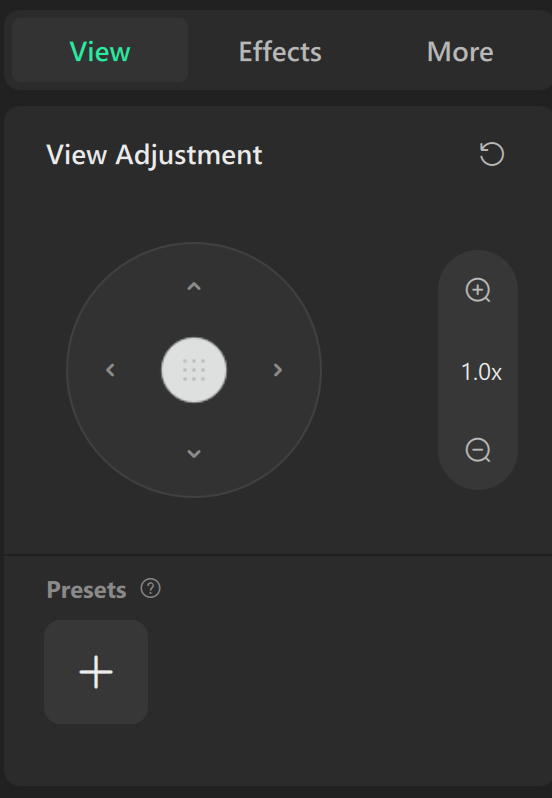
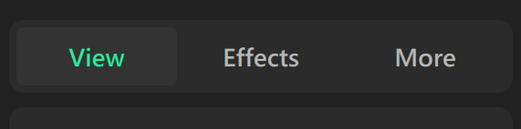

# Visual settings — estudo e estratégia

Data: 17 de setembro de 2026. **Status: implementado após autorização do usuário.**

Pedido de Marcelo Bossle: aproximar os controles das referências, considerar abas
View / Effects / More para posição, background, efeitos e cores, e eliminar a barra
superior branca. O estudo foi inicialmente entregue sem alterações de produto. Após
o pedido “implemente”, a janela e os recursos descritos abaixo foram desenvolvidos.

## Implementação entregue

- Abas View / Effects / More, cores grafite e destaque verde em recursos locais
  (`Controls/SettingsTheme.xaml`), preservando o tema da janela principal.
- Cabeçalho próprio com `WindowChrome`, usando o mesmo fundo da janela, botões de
  minimizar/maximizar/fechar e redimensionamento. Foi escolhido diretamente em vez
  da tentativa DWM seguida de fallback proposta no estudo. Recursos de alto contraste
  acompanham as cores do sistema.
- Pad circular (`Controls/PositionPad.cs`) com arraste, setas repetíveis, teclado e
  mapeamento que preserva os cantos do domínio X/Y; zoom e edição numérica. Reset de
  geometria separado do reset completo, que oferece desfazer.
- Quatro amostras de paleta, intensidade, glow e sensibilidade com os limites anteriores.
  Living Fire mostra a direção das frequências e permite ocultar as faíscas.
- Presets completos por wallpaper: salvar com nome, aplicar, renomear e excluir;
  atalhos em View e gestão em More. Os atalhos usam nomes, não capturas de miniatura.
  Limite de 200 presets; excluir um preset não altera a configuração em uso.
- No Living Fire: fundo original, cor hexadecimal ou imagem local em Cover. O fundo
  permanece fixo quando o fogo muda de posição/escala; a composição GPU usa a
  transmitância do volume, sem remover pixels pretos por tolerância.
- Imagens importadas para `%LocalAppData%/HYPNIX/Backgrounds`, convertidas em PNG e
  reduzidas a no máximo 2048 pixels por lado. Entrada limitada a 32 MiB, 64 megapixels
  e 16.384 pixels por lado. Ausência/falha de imagem retorna ao fundo original.
- Novos campos opcionais `Background`, `Sparks` e `VisualizerPresets`, mantendo
  `SchemaVersion = 1`. Preferências antigas continuam carregando; novos valores são
  normalizados sem modificar configurações de outros wallpapers.

Validação: 144 testes unitários; smoke dos 13 wallpapers; testes de abas sem alteração
de valores, resets, desfazer, presets, capacidades e capturas a 420 × 760 / 360 × 420 DIP.
GPU validou cor/imagem, fallback de arquivo ausente, fundo fixo, faíscas, pausa e resposta
por frequência. O estudo de fogo também passou 30 segundos de reprodução (120 simulados).
Capturas e relatórios locais ficam em `artifacts/settings-redesign/` (não versionados).

A matriz física completa de múltiplos monitores/DPI, alto contraste e leitores de tela
continua como validação de release. Fundos para os demais renderizadores, fundos em vídeo,
paletas livres e miniaturas reais dos presets permanecem expansões futuras. A aprovação
visual do usuário ocorreu durante a implementação; as seções seguintes preservam o
estudo original e suas decisões propostas, não uma lista de recursos já disponíveis.

## 1. Leitura das referências

As imagens mostram um painel grafite com superfícies arredondadas e contraste discreto.
No topo, três abas ocupam a mesma largura. A selecionada ganha uma superfície um pouco
mais clara e texto verde. Abaixo, um cartão “View Adjustment” reúne título, reset local,
controle circular de posição com quatro direções e um puxador central. À direita fica
uma cápsula vertical de zoom: aumentar, valor atual e diminuir. Uma divisória separa
os ajustes da área de presets, com botão “+”.

A direção proposta é manter essa hierarquia e a leitura simples: navegação fixa,
um grupo de ajustes por vez, valores visíveis e ações locais próximas ao que modificam.
As imagens são referências de design fornecidas pelo usuário, não assets da aplicação.

## 2. Diagnóstico do código atual

| Área | Situação encontrada | Consequência para o plano |
| --- | --- | --- |
| `VisualizerSettingsWindow.xaml` | Janela WPF 420 × 720, mínimo 360 × 420; grupos Appearance e Audio em uma rolagem | Reorganizar a janela existente, preservando acesso pela engrenagem |
| Barra de título | `MainWindow_Loaded` solicita modo escuro via DWM somente para a janela principal | A janela de ajustes precisa receber seu próprio tratamento; esta é a causa provável da faixa branca relatada |
| Tema | Fundo local `#0F141B`, brushes compartilhados azulados e destaque azul | Criar recursos semânticos próprios para o painel grafite; não recolorir toda a aplicação incidentalmente |
| Interação | `Changed` envia preferências; `MainWindow.ApplyVisualizerPreferences` normaliza, atualiza preview/sessão e agenda gravação | Reutilizar esse fluxo; trocar de aba não deve gerar mudanças nem reiniciar animação |
| Geometria | Scale 0,3–3; OffsetX/OffsetY −1–1; visibilidade por `SupportsLayoutControls` | Pad e zoom substituem os sliders sem alterar unidades, valores salvos ou disponibilidade |
| Aparência e áudio | Quatro paletas, Glow 0–3, Intensity 0–8, Sensitivity 0–12 | Esses controles podem ser reorganizados já na primeira implementação |
| Background | Catálogo/request têm `BackgroundPath`, mas não há seletor universal nem preferência de fundo por visualizador | Background personalizado exige suporte explícito do renderizador e persistência nova |
| Presets | Há preferências por wallpaper e defaults; não há biblioteca de presets do usuário | O botão “+” envolve modelo e armazenamento novos, não apenas aparência |

O diagnóstico da faixa branca foi feito pelo código e pelo relato; as imagens anexadas
mostram a referência desejada, não uma captura da janela atual com o defeito.

## 3. Organização proposta

O título da janela identifica o wallpaper selecionado. Abaixo, as abas **View / Effects / More**
ficam sempre visíveis. Só o conteúdo da aba rola. Manter os nomes das referências nesta
proposta; textos devem ficar preparados para futura localização.

| Aba | Conteúdo | Primeira entrega futura / expansão |
| --- | --- | --- |
| **View** | View Adjustment: posição, zoom e reset de geometria. Background em cartão separado. Presets rápidos ao final | Posição/zoom reaproveitam o motor; background e presets entram em fases próprias |
| **Effects** | Paletas de cores, intensidade, glow; grupo Audio com sensibilidade e indicação da resposta sonora | Migrar os controles existentes primeiro; opções específicas só quando houver suporte real |
| **More** | Gerenciar presets, restaurar este wallpaper, informações e créditos | Reset e créditos primeiro; gestão de presets depois |

Background significa a camada atrás da animação atual. Escolher outro wallpaper continua
sendo uma ação da galeria. FPS e políticas globais de pausa permanecem no seu contexto atual.

### View: posição e zoom

- Pad circular visualmente próximo à referência, com centro arrastável e quatro botões
  direcionais. Arrastar deve mover a imagem na mesma direção percebida pelo usuário.
- A posição é absoluta e permanece onde foi deixada, não funciona como joystick que
  continua deslocando ou volta sozinho ao centro.
- Cada toque nas setas desloca 0,02; repetição ao segurar. Teclado oferece o mesmo controle.
  Permitir edição numérica de X/Y em uma expansão compacta “Valores”.
- Preservar todo o domínio de X/Y, inclusive combinações nos extremos: o formato circular
  não pode apagar ou normalizar posições existentes nos cantos. Validar o mapeamento do
  arraste com esses casos antes de fechar o componente.
- Cápsula de zoom com “+”, valor como `1.00×` e “−”; passo 0,05, limites atuais 0,30–3,00.
  O valor pode ser editado; entrada inválida mostra erro e mantém o último valor válido.
- Reset ao lado de View Adjustment restaura apenas escala e posição aos defaults do
  wallpaper. Tooltip explícito; não modifica cor, áudio ou background.
- Quando o wallpaper não suporta geometria, ocultar o pad e o zoom. Se View ainda não
  tiver outro recurso disponível, mostrar uma explicação curta, sem controles inoperantes.

### View: background e presets rápidos

Background terá opções “Original”, “Cor sólida” e “Imagem local”, apenas conforme suporte.
Mostrar miniatura e nome do arquivo; “Original” restaura a composição do wallpaper.
Para imagens, começar com enquadramento Cover, sem distorção. Vídeo como fundo fica para
uma avaliação posterior de decodificação, memória e pausa por monitor.

O fundo deve ter transformação própria: mover/zoomar o fogo não move automaticamente a
imagem de fundo. No Living Fire, preservar fogo até as extremidades no tamanho padrão.

Presets rápidos seguem a referência: miniaturas e “+” para salvar com nome. Um preset
representa a configuração completa daquele wallpaper, incluindo fundo quando disponível.
Aplicá-lo atualiza todos os valores de uma vez. More gerencia a mesma coleção, sem uma
segunda biblioteca. Presets de outro wallpaper não aparecem como se fossem compatíveis.

### Effects e More

Effects apresenta as quatro paletas atuais como amostras visuais com nome e seleção
identificável. Preservar seus IDs: renomear uma paleta não pode trocar a cor já salva.
Paletas personalizadas são expansão do modelo, não requisito da reorganização inicial.

Intensity, Glow e Sensitivity mantêm faixas e significado atuais. Zero de sensibilidade
significa ausência de reação ao áudio, não parar a captura compartilhada de outros usos.
Para Living Fire, uma indicação explica “Agudos à esquerda · Graves à direita”. Controle
de velocidade e botão de partículas só serão exibidos quando houver contrato persistido
e suporte no motor; não acrescentar botões que apenas aparentem funcionar.

More reúne gerenciamento de presets, reset completo do wallpaper e créditos. O reset
completo deve permitir desfazer a última restauração e não excluir presets salvos. Créditos
de Living Fire: “Criado por Marcelo Bossle — todos os direitos reservados”. Outros efeitos
mantêm suas respectivas atribuições.

## 4. Linguagem visual e barra superior

Paleta inicial proposta, aproximada visualmente das referências, a validar em mockup:

| Recurso semântico | Cor sugerida | Uso |
| --- | --- | --- |
| SettingsWindowBackground | `#222222` | Fundo externo e barra de título |
| SettingsSurface | `#2B2B2B` | Cartões e trilho das abas |
| SettingsControlSurface | `#343434` | Aba selecionada, pad e cápsula de zoom |
| SettingsStroke | `#454545` | Contornos e divisórias discretas |
| SettingsTextPrimary | `#F2F2F2` | Títulos e valores |
| SettingsTextSecondary | `#B8B8B8` | Rótulos auxiliares |
| SettingsAccent | `#00D99A` | Seleção e ações de destaque |

Janela e barra de título devem usar o mesmo token de fundo, inclusive quando a janela
perde foco. A navegação pode usar a superfície dos cartões, como na referência. Menus,
listas abertas, campos e tooltips próprios também precisam seguir o tema, sem faixas brancas.

Usar raios de 12–16 DIP nos blocos, espaçamento de 8/12/16/24 DIP, fonte Segoe UI Variable
com fallback Segoe UI e alvos de pelo menos 40 DIP para botões de toque. Não escalar a
captura literalmente: começar com a janela atual, pad entre 168–220 DIP conforme largura,
zoom ao lado e conteúdo com rolagem na altura mínima. Seleção combina cor e superfície;
foco de teclado tem contorno visível próprio.

### Estratégia para a barra branca

1. Isolar o tratamento de tema da janela em um helper reutilizável e aplicá-lo ao HWND
   de ajustes em `SourceInitialized`, antes da primeira exibição.
2. Em Windows compatível, usar `DWMWA_CAPTION_COLOR` com a mesma cor sólida do fundo e
   `DWMWA_TEXT_COLOR` para o título. Solicitar também modo escuro para o frame. Apenas
   habilitar modo escuro não garante igualdade exata com a cor do painel.
3. Tratar mudanças de tema/ativação e retornos de erro. A Microsoft documenta as cores
   explícitas de caption/texto a partir do Windows 11 build 22000.
   [Fonte: atributos DWM](https://learn.microsoft.com/en-us/windows/win32/api/dwmapi/ne-dwmapi-dwmwindowattribute).
4. Se o sistema suportado não permitir garantir essa cor, usar cabeçalho WPF com
   `WindowChrome`, preservando arraste, redimensionamento, menu de sistema, comandos de
   janela e teclado. Não aceitar uma barra branca como fallback do tema escuro.
   [Fonte: WindowChrome](https://learn.microsoft.com/en-us/dotnet/api/system.windows.shell.windowchrome).
5. No alto contraste, respeitar as cores de acessibilidade do sistema. Isso é um modo
   distinto do tema grafite, não uma falha a mascarar com cores fixas.

Para esta janela, a proposta é superfície sólida previsível. A adoção geral de WPF UI/Mica
documentada em UI_ARCHITECTURE continua separada; não é dependência para este ajuste.

## 5. Integração e persistência

Criar componentes de apresentação reutilizáveis para abas, pad, zoom e amostras de cores.
Eles emitem valores/comandos; a janela não passa a gerenciar D3D, áudio ou sessões.
Manter `LoadValues` sem emitir alterações e manter a gravação agrupada por `QueueSave`.
Ao arrastar, atualizar ao vivo sem escrever em disco a cada pixel. Ao fechar, preservar
as alterações já aplicadas, como hoje; trocar de aba não implica salvar ou cancelar.

Expandir capacidades por wallpaper para Background, ColorPalette e opções específicas
quando esses recursos forem implementados. O booleano atual de geometria continua válido
na primeira fase. Ao mudar a seleção na galeria com a janela aberta, atualizar título,
valores, capacidades e presets juntos; não aplicar valores antigos ao novo wallpaper.

Background requer composição dentro do renderizador. Living Fire hoje produz uma imagem
opaca sobre preto: colocar uma imagem WPF atrás dessa superfície não fará o fundo aparecer.
Definir contribuição/transmitância do fogo e composição com o fundo no pipeline GPU;
não remover preto por uma tolerância que destrua fumaça e bordas. Validar a mesma
composição no preview e no desktop, respeitando a fronteira HWND/WPF.

Proposta de dados futuros: preferência de background com tipo/cor/referência de imagem;
preset com ID, nome, wallpaperId, versão e snapshot das opções. Arquivos escolhidos podem
ser copiados para a biblioteca local gerenciada para sobreviver à mudança do original.
Arquivo indisponível deve retornar ao fundo original com indicação na UI, sem interromper
o wallpaper. Limitar dimensões/memória de imagens durante a importação.

O loader atual aceita somente SchemaVersion 1; portanto uma futura mudança de schema
exige migração explícita antes de incrementar esse número. Preservar os sete campos
atuais, defaults específicos de Living Fire, wallpapers importados e configurações
existentes. Presets devem referenciar imagens, sem embutir bytes no settings.json, que
hoje possui limite de leitura de 1 MiB.

## 6. Sequência de execução futura

| Fase | Entrega verificável | Dependência |
| --- | --- | --- |
| 0 — Este estudo | Descrição, referências, decisões e critérios registrados | Concluída; nenhuma alteração de produto |
| 1 — Mockup | Três abas, estados selecionado/foco, tamanho normal e mínimo, cabeçalho integrado | Próxima etapa proposta, aguardando pedido para avançar |
| 2 — Janela e controles existentes | Barra sem branco, tema, abas, pad/zoom, cores, glow, intensidade e áudio | Layout definido; contratos atuais preservados |
| 3 — Presets | Salvar/aplicar/renomear/excluir, restauração com desfazer e migração | Modelo e persistência validados |
| 4 — Background | Original/cor/imagem, composição GPU, persistência e capacidades | Prova de composição e orçamento de memória |
| 5 — Opções de efeitos | Controles específicos suportados por cada efeito | Contratos reais de renderização e defaults |

Não publicar botões de recursos ainda indisponíveis. A ordem entrega a correção visual
e os controles existentes antes das mudanças mais amplas de composição.

## 7. Critérios de aceite e testes futuros

- Comparar capturas com as referências: hierarquia, espaçamentos, abas iguais, pad,
  cápsula de zoom, fundo grafite e ausência de barra branca ao abrir, ativar/desativar
  e alternar o tema do Windows. Verificar separadamente a primeira abertura.
- Verificar 360 × 420 e 420 × 720 DIP, escalas 100/125/150/175/200%, troca entre monitores
  de DPI diferente e janela dentro da área útil. Sem recorte de botões ou rolagem horizontal.
- Navegação por Tab, setas nas abas e no pad, Enter/Espaço nos botões; nomes acessíveis,
  contraste, foco e estados desabilitados. A aba selecionada não depende só do verde.
- Testar limites, centro, diagonais, sinal vertical, passos do zoom e valores inválidos.
  Reset de geometria não altera aparência; reset completo usa defaults daquele wallpaper.
- Trocar abas e carregar valores não emite Changed; arrastar altera preview e sessão
  correta; trocar wallpaper não transporta suas preferências para outro.
- Manter os testes unitários e smoke existentes. Acrescentar testes de comportamento
  do pad, presets/migração e capacidades quando essas partes forem implementadas.
- Para background, validar imagem ausente/grande, bordas sem halo, troca em pausa,
  congelamento independente por monitor, desligamento e liberação dos recursos GPU.
- Manter a velocidade atual do fogo, cobertura da largura e frequências agudo/esquerda,
  grave/direita. Medir custo de GPU antes/depois da composição com fundo.

Na etapa inicial, a entrega foi somente documental. Os testes e o resultado da implementação
posterior estão registrados em “Implementação entregue”, no início deste documento.
